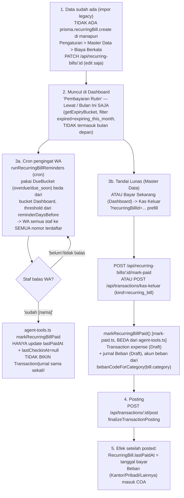

# Check-Flow — Biaya Berkala (RecurringBill)

Alur nyata (dari kode, bukan asumsi) untuk 1 RecurringBill. **Beda mendasar** dari Domain/Server/
Maintenance: model ini TIDAK punya `clientId` sama sekali (`prisma/schema.prisma:291-312`) —
punya `vendorId` sebagai gantinya. Ini murni modul pengeluaran internal (tagihan kantor,
langganan, dsb), tidak pernah lewat Invoice/Piutang/"Tagih Sekarang".

> **Update:** create (`POST /api/recurring-bills`) dan tombol "Tambah Biaya Berkala" ditambahkan
> supaya konsisten dengan Server/Maintenance — sebelumnya modul ini edit-only. Deaktivasi (bukan
> hapus) sudah ada dari awal lewat `ActiveToggle` di kolom "Aktif" (`MasterDataPanel.tsx`), PATCH
> `active: false` — baris nonaktif otomatis lolos dari semua filter `active: true` (Dashboard,
> cron reminder, laporan neraca), tapi datanya tetap ada di database.

## Diagram



## Penjelasan tiap langkah

### 1. Master Data — sekarang bisa create + edit
- **Di mana:** Pengaturan → Master Data → tab Biaya Berkala (`MasterDataPanel.tsx`, `BiayaBerkalaSection`, ~line 1718+), tombol "Tambah Biaya Berkala".
- **API:** `POST /api/recurring-bills` (`src/app/api/recurring-bills/route.ts`, owner-only) + `PATCH /api/recurring-bills/[id]` + `GET` (list, dipakai juga oleh route index-nya).
- **Field kunci (schema.prisma:291-312):** `name`, `identifier` (Nomor ID/Keterangan — mis. nomor pelanggan PLN), `vendorId`, `category` (`"kantor" | "pribadi" | "lainnya"`, default `"kantor"`), `periodId`+`periodCount`, `price`, `lastPaidAt`, `lastCheckinAt` (kapan terakhir ditanya via WA — lihat langkah 3a), `active`.
- Modal edit (`MasterDataPanel.tsx` ~1780-1809) cuma expose: name, identifier, vendorId, category, price, active, lastPaidAt.

### 2. Muncul di Dashboard
- **Di mana:** `RecurringDueSection` (`DashboardSections.tsx:291-345`), data dari `dashboard/page.tsx:101-117`.
- **Bucket:** pakai `getExpiryBucket(nextDue)` — sistem 4-bucket yang sama dengan Domain/Server (`expired|expiring_this_month|expiring_next_month|safe`) — tapi filter cuma ambil `expired` atau `expiring_this_month` (line 116), **`expiring_next_month` DIKECUALIKAN**, sama seperti Maintenance.
- Kolom "Nomor ID/Keterangan" bisa diedit inline langsung di Dashboard lewat `EditableIdentifier.tsx` (PATCH `/api/recurring-bills/:id`, field `identifier`).
- Aksi (owner-only): `RecurringBillPaymentCell` → tombol "Bayar Sekarang" yang redirect ke `/keuangan/kas-keluar?recurringBillId=...` (prefill baris "Bayar Biaya Berkala" di `KasKeluarPanel.tsx`).

### 3a. Pengingat WhatsApp otomatis (FITUR UNIK — tidak ada di Domain/Server/Maintenance)
- **Cron:** `src/lib/cron/recurring-bill-reminders.ts` (`runRecurringBillReminders`) — pakai sistem bucket BERBEDA: `DueBucket` (`overdue|due_soon|ok`) dari `computeNextDueDate`+`getDueBucket`, ambang `reminderDaysBefore` dari `BillingPeriod`. Bill yang bucket-nya bukan `"ok"` DAN `lastCheckinAt` belum kesetel hari ini → di-klaim atomik (`updateMany`) lalu WA ke SEMUA staf yang punya nomor telepon: *"Reminder biaya berkala: {name} ({price}) sudah/segera jatuh tempo. Sudah dibayar? Balas 'sudah {name}' atau 'belum'."*
- **PENTING — gap nyata:** kalau staf balas "sudah {name}", itu memicu `markRecurringBillPaid` di `src/lib/agent-tools.ts:295-304` — **fungsi yang BEDA** dari `markRecurringBillPaid` di `mark-paid.ts`! Versi agent-tools ini cuma `prisma.recurringBill.update({ data: { lastPaidAt: new Date(), lastCheckinAt: null } })` — **TIDAK membuat Transaction atau jurnal apa pun**. Jadi kalau staf cuma balas WA tanpa juga input lewat Tandai Lunas/Kas Keluar, pengeluarannya TIDAK PERNAH tercatat di pembukuan, padahal `lastPaidAt` sudah keupdate (kelihatan seperti sudah beres).
- `getPendingBillCheckins()` (`agent-tools.ts:289-293`) — query AI buat staf cek "bill mana yang masih nunggu balasan saya" (`lastCheckinAt` kesetel TAPI `lastPaidAt` masih lebih lama dari `lastCheckinAt`).

### 3b-4. Bayar & Posting (jalur resmi yang BENERAN bikin jurnal)
- **Tandai Lunas** (Master Data, `MasterDataPanel.tsx:1896-1898`, muncul kalau `active && price`): `POST /api/recurring-bills/:id/mark-paid` (owner-only, wajib `accountId`+bill.price>0).
- **Kas Keluar** (Dashboard "Bayar Sekarang" atau input manual pilih Tipe "Bayar Biaya Berkala"): `POST /api/transactions/kas-keluar`, baris `kind: "recurring_bill"` (`kas-keluar/route.ts:86-98`).
- Keduanya manggil `markRecurringBillPaid` di **`src/lib/accounting/mark-paid.ts:145-182`** (bukan yang di agent-tools.ts) → bikin `Transaction` (expense, draft, `refType: "recurring_bill"`) + jurnal draft lewat `billPaidLines`, akun beban dari **`bebanCodeForCategory(bill.category)`**:
  ```ts
  // coa-seed.ts:44-68
  bebanKantor: "6-1000", bebanPribadi: "6-2000", bebanLain: "6-3000"
  function bebanCodeForCategory(category) {
    if (category === "kantor") return COA_CODE.bebanKantor
    if (category === "pribadi") return COA_CODE.bebanPribadi
    return COA_CODE.bebanLain
  }
  ```
  **BEDA DARI DOMAIN/SERVER/MAINTENANCE** yang masing-masing pakai 1 kode akun beban tetap — RecurringBill akun bebannya dinamis tergantung `category` yang dipilih staf.
- Posting: `POST /api/transactions/:id/post` → `finalizeTransactionPosting` (`mark-paid.ts:223-224`) — cuma `tx.recurringBill.update({ data: { lastPaidAt: transaction.occurredAt, lastCheckinAt: null } })`, sama simpelnya dengan Maintenance (satu field utama, plus reset `lastCheckinAt`).

### Deaktivasi
- **Via UI:** `ActiveToggle` di kolom "Aktif" (`MasterDataPanel.tsx`, `BiayaBerkalaSection`) → `PATCH /api/recurring-bills/:id` dengan `{ active: false }`. Baris nonaktif otomatis lolos dari semua filter `active: true` (Dashboard, cron reminder WA, `laporan/neraca`) tapi TIDAK dihapus dari database.
- **Via AI:** `deactivateRecurringBill` (`agent-tools.ts:211-220`) — cari bill aktif by nama (fuzzy match), kalau ambigu return daftar match, kalau ketemu 1 → `active: false` + `logDeactivation`. Padanan persis `deactivateDomain`/`deactivateServer`.

## Yang perlu diwaspadai (bukan bug, tapi gampang salah paham)
1. **Balas WA "sudah [nama]" TIDAK bikin catatan pengeluaran** — cuma update tanggal. Ini gap paling penting untuk staf pahami: kalau cuma balas WA, uangnya kelihatan "sudah dibayar" di tanggal tapi TIDAK MASUK laporan keuangan sama sekali. Wajib tetap input lewat Tandai Lunas/Kas Keluar.
2. **Dua sistem bucket berjalan paralel dan TIDAK SINKRON**: Dashboard pakai `ExpiryBucket` (2 dari 4 kategori dipakai), sementara cron reminder WA & Master Data pakai `DueBucket` (`overdue/due_soon/ok`, ambang dari `reminderDaysBefore`). Bisa saja WA reminder sudah masuk duluan sebelum row-nya kelihatan di Dashboard, atau sebaliknya — dua tempat ini tidak selalu sepakat "sudah waktunya" atau belum.
3. **Akun beban dinamis dari Kategori** — pastikan kategori (Kantor/Pribadi/Lainnya) di Master Data benar sebelum ditandai lunas, karena itu langsung menentukan pos beban di laporan.
4. Tidak ada `expiryDate` — sama seperti Maintenance, jatuh tempo dihitung ulang dari `lastPaidAt` + periode saat itu juga, bukan anchor tersimpan.
