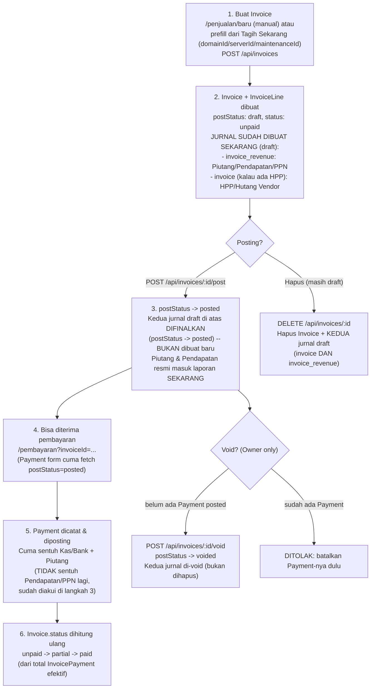

# Check-Flow — Penjualan & Invoice

Alur nyata (dari kode, bukan asumsi) untuk Invoice — modul inti penjualan, dipakai bareng oleh
Domain/Server/Maintenance ("Tagih Sekarang") dan berdiri sendiri (invoice manual). Beda dari
modul lain yang sudah didokumentasikan, Invoice juga punya jalur ketiga yang unik: **Invoice
Termin Project**, yang skip draft sama sekali.

## Diagram — Invoice manual/Tagih Sekarang

## Penjelasan tiap langkah (jalur manual / Tagih Sekarang)

### 1. Buat Invoice
- **Di mana:** `/penjualan/baru` (`InvoiceForm.tsx`). Query param `clientId`/`description`/`amount`/`domainId`/`serverId`/`maintenanceId` (dari tombol "Tagih Sekarang" Dashboard) prefill baris pertama + cost-link.
- Tiap `InvoiceLine` bisa pilih dari katalog `Item` (`defaultPrice`/`defaultCost` auto-isi `unitPrice`/`unitCost`) atau isi manual — semua tetap bisa diedit override per baris.
- Header: Diskon Tambahan, toggle PPN (`ppnRate` default dari `Settings.defaultPpnRate`), Jatuh Tempo (auto issuedAt+7 hari sampai diubah manual).
- **API:** `POST /api/invoices` (`src/app/api/invoices/route.ts:46-167`) — validasi ulang & HITUNG ULANG semua total di server (tidak percaya angka dari client): `subtotal`, `totalCost`, `discountAmount` (baris+header), `ppnAmount` (dibulatkan), `totalAmount`.
- `costLinkType`/`costLinkId` diturunkan dari `domainId`/`serverId`/`maintenanceId` (prioritas domain > server > maintenance kalau lebih dari satu somehow terkirim).

### 2. Jurnal DIBUAT SAAT INVOICE DIBUAT (bukan saat posting) — poin paling gampang salah paham
- **Ini kunci dari seluruh modul cash vs accrual di aplikasi ini.** Saat `POST /api/invoices` sukses, DALAM TRANSAKSI YANG SAMA sistem langsung bikin (komentar eksplisit di `route.ts:134-137`): jurnal `invoice_revenue` (Piutang Usaha debit, Pendapatan + PPN Keluaran kredit — `invoiceRevenueLines`, `journal-rules.ts:20-37`) dan, kalau ada HPP (`totalCost > 0`), jurnal `invoice` (HPP debit, Hutang Usaha Vendor kredit — `invoiceCostLines`, `journal-rules.ts:9-15`).
- TAPI kedua jurnal ini dibuat dengan `postStatus: "draft"` — jadi walau sudah "ada", efeknya NOL di laporan/piutang sampai invoice-nya benar-benar diposting (langkah 3). Istilah "diakui saat invoice terbit" di dokumentasi staf artinya "terbit" = "posted", bukan cuma dibuat.
- `revenueCoaCode` default `COA_CODE.pendapatanJasa`, bisa di-override (Invoice termin project pakai `pendapatanProject`, lihat bagian terpisah di bawah).

### 3. Posting Invoice
- **Di mana:** `/penjualan/[id]`, tombol "Posting Invoice" (`InvoicePostButton`, cuma muncul saat draft).
- **API:** `POST /api/invoices/[id]/post` — `postJournalEntryFinal` untuk `sourceType: "invoice"` (HPP, kalau ada) DAN `sourceType: "invoice_revenue"` — keduanya FINALISASI jurnal yang SUDAH ADA dari langkah 1 (bukan bikin baru), lalu `Invoice.postStatus -> posted`.
- Baru dari titik ini invoice: (a) resmi kehitung sebagai Piutang di laporan, (b) muncul di daftar pilihan invoice pada form Pembayaran (form itu cuma `fetch` invoice `postStatus: posted`).

### 4-6. Pembayaran & status
- `POST /api/payments` mencatat pelunasan — jurnalnya (`invoicePaymentLines`) CUMA debit Kas/Bank + kredit Piutang Usaha, TIDAK menyentuh Pendapatan/PPN lagi (sudah diakui di langkah 3). Ini murni pelunasan piutang, bukan pengakuan pendapatan baru.
- `Invoice.status` (`unpaid|partial|paid`) dihitung ULANG setiap kali Payment terkait di-posting atau di-void (`src/app/api/payments/[id]/post/route.ts`, `.../void/route.ts`) — dari total `InvoicePayment` yang efektif (baris migrasi lama `paymentId: null`, ATAU payment induknya `postStatus: posted`). `newStatus = totalPaid >= totalAmount - 0.5 ? "paid" : totalPaid > 0 ? "partial" : "unpaid"`.

### Hapus Invoice Draft
- **API:** `DELETE /api/invoices/[id]` (`src/app/api/invoices/[id]/route.ts:20-39`) — cuma boleh kalau `postStatus === "draft"`.
- **BARU DIPERBAIKI:** sebelumnya cuma menghapus jurnal draft `sourceType: "invoice"` (HPP), jurnal `invoice_revenue` (Piutang/Pendapatan/PPN) KETINGGALAN dan jadi nyangkut permanen nunjuk ke invoice yang sudah tidak ada. Sekarang keduanya (`sourceType: { in: ["invoice", "invoice_revenue"] }`) ikut dibersihkan dalam satu `deleteMany`.

### Void Invoice (Owner-only)
- **API:** `POST /api/invoices/[id]/void` — cuma untuk `postStatus === "posted"` (draft pakai Hapus, bukan Void).
- **Restriksi:** ditolak kalau ada `InvoicePayment` efektif (legacy `paymentId: null` ATAU payment induk `postStatus: posted`) — pesan error: "Invoice ini sudah ada pembayaran — batalkan dulu pembayarannya sebelum membatalkan invoice."
- Efek: `voidJournalEntryBySource` untuk `"invoice"` dan `"invoice_revenue"` (jurnal ditandai voided, bukan dihapus — tetap kelihatan di Jurnal Umum dengan badge "Dibatalkan" untuk jejak audit), `Invoice.postStatus -> voided`.

### Status "Diklaim Lunas" (`claimed_paid`)
- Diset EKSKLUSIF oleh AI agent tool `claimPayment` (`agent-tools.ts:327-338`) — dipakai kalau client self-report "sudah bayar" lewat chat/WA bot. TIDAK bikin `InvoicePayment`/jurnal apa pun — murni flag "tolong staf cek mutasi rekening".
- Tetap dianggap outstanding di semua laporan (`status: { in: ["unpaid","partial","claimed_paid"] }` — Piutang, Neraca, Dashboard, agent tools). Begitu staf input & posting Payment sungguhan, status recompute (§4-6) akan OVERRIDE `claimed_paid` jadi `unpaid/partial/paid` sesuai kenyataan.

## Jalur berbeda: Invoice Termin Project (auto-generate)

`src/lib/project-termin.ts` `generateTerminInvoice()`, dipanggil dari:
- Tombol manual "Generate Invoice Sekarang" di detail Proyek (`POST /api/projects/[id]/schedules/[scheduleId]/generate-invoice`).
- Cron harian `runProjectTerminInvoicing()` (`src/lib/cron/project-termin-invoicing.ts`) — cari `ProjectPaymentSchedule` yang `invoiceId: null`, `dueDate` = H-3 dari hari ini, proyeknya `status: "berjalan"`.

**Beda total dari invoice manual/Tagih Sekarang:**
1. **Idempotent** — kalau `schedule.invoiceId` sudah keisi, tidak generate ulang (baik dari tombol manual maupun cron).
2. **SKIP draft sama sekali** — dibuat langsung `postStatus: "posted"` (+ `postedAt`/`postedById`), jurnalnya juga langsung `posted`, bukan draft-lalu-difinalkan.
3. **Tidak ada HPP/biaya modal** — termin project tidak melacak `unitCost`/`totalCost`, `invoiceCostLines` tidak pernah dipanggil.
4. **`revenueCoaCode` khusus:** `COA_CODE.pendapatanProject` — bukan `pendapatanJasa` default, supaya pendapatan proyek kelihatan terpisah di Laba Rugi.
5. 1 baris tetap (`qty: 1`, `unitPrice = schedule.amount`), tanpa PPN, tanpa `dueDate` di invoice, tanpa `costLinkType/costLinkId` (link-nya lewat `ProjectPaymentSchedule.invoiceId`/`invoiceGeneratedAt`, mekanisme terpisah dari cost-link Domain/Server/Maintenance).

## Yang perlu diwaspadai (bukan bug, tapi gampang salah paham)
1. **Pendapatan diakui saat POSTING invoice, bukan saat dibayar** — laporan Laba Rugi bisa menunjukkan pendapatan dari piutang yang belum tentu cair. Ini standar akuntansi akrual, tapi gampang bikin bingung staf yang berpikir cash-basis.
2. **Invoice draft = tidak bisa diedit** — pola "hapus draft, input ulang" sama seperti Payment/Transaction, bukan bug.
3. **Void ditolak kalau sudah ada pembayaran** — harus batalkan Payment dulu, urutannya penting.
4. **`claimed_paid` bukan status resmi lunas** — jangan salah kira invoice itu sudah beres cuma karena badge-nya "Diklaim Lunas".
5. **Invoice Termin Project itu jalur SAMA SEKALI TERPISAH** — tidak lewat draft, tidak ada HPP, akun pendapatannya beda kode. Jangan disamakan cara analisisnya dengan invoice biasa.
6. Bug lama (sekarang sudah diperbaiki): hapus invoice draft dulu cuma bersihin jurnal HPP, jurnal Piutang/Pendapatan/PPN-nya nyangkut. Kalau nemu jurnal draft `invoice_revenue` yang `sourceId`-nya sudah tidak ada invoice-nya (dari sebelum perbaikan ini), itu peninggalan bug lama, aman dihapus manual lewat Jurnal Umum.
