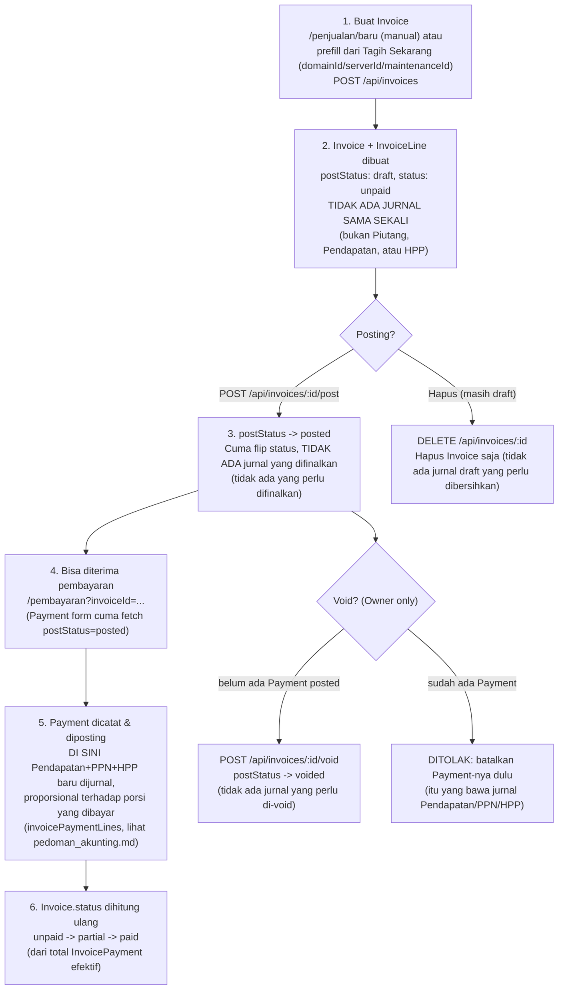

# Check-Flow — Penjualan & Invoice

Alur nyata (dari kode, bukan asumsi) untuk Invoice — modul inti penjualan, dipakai bareng oleh
Domain/Server/Maintenance ("Tagih Sekarang") dan berdiri sendiri (invoice manual). Beda dari
modul lain yang sudah didokumentasikan, Invoice juga punya jalur ketiga yang unik: **Invoice
Termin Project**, yang skip draft sama sekali.

> **Cash-basis penuh** (lihat `pedoman_akunting.md` untuk detail jurnal lengkap): Invoice TIDAK
> PERNAH bikin jurnal apa pun — Pendapatan, PPN, DAN HPP semuanya baru diakui SEKALIGUS saat
> Payment-nya diposting, bukan saat invoice dibuat/diposting.

## Diagram — Invoice manual/Tagih Sekarang

## Penjelasan tiap langkah (jalur manual / Tagih Sekarang)

### 1. Buat Invoice
- **Di mana:** `/penjualan/baru` (`InvoiceForm.tsx`). Query param `clientId`/`description`/`amount`/`domainId`/`serverId`/`maintenanceId` (dari tombol "Tagih Sekarang" Dashboard) prefill baris pertama + cost-link.
- Tiap `InvoiceLine` bisa pilih dari katalog `Item` (`defaultPrice`/`defaultCost` auto-isi `unitPrice`/`unitCost`) atau isi manual — semua tetap bisa diedit override per baris.
- Header: Diskon Tambahan, toggle PPN (`ppnRate` default dari `Settings.defaultPpnRate`), Jatuh Tempo (auto issuedAt+7 hari sampai diubah manual).
- **API:** `POST /api/invoices` (`src/app/api/invoices/route.ts`) — validasi ulang & HITUNG ULANG semua total di server (tidak percaya angka dari client): `subtotal`, `totalCost`, `discountAmount` (baris+header), `ppnAmount` (dibulatkan), `totalAmount`.
- `costLinkType`/`costLinkId` diturunkan dari `domainId`/`serverId`/`maintenanceId` (prioritas domain > server > maintenance kalau lebih dari satu somehow terkirim) — dipakai nanti oleh `revenueCoaCodeForInvoice()` saat Payment-nya diposting (lihat §2).

### 2. TIDAK ADA JURNAL SAMA SEKALI di titik ini
- **Ini kunci dari seluruh modul cash-basis di aplikasi ini** (lihat `aturan.txt`: "Piutang hanya catatan, Pendapatan diakui setelah ada uang masuk"). `POST /api/invoices` cuma `tx.invoice.create` + `InvoiceLine` + update `BillingFollowUp` (SLA) kalau ada cost-link — TIDAK ADA `postJournalEntry` sama sekali, baik untuk Piutang/Pendapatan/PPN maupun HPP.
- Invoice yang belum dibayar sisa tagihannya dihitung sebagai FIELD BIASA (`Invoice.totalAmount − total InvoicePayment efektif`), bukan dari saldo akun GL manapun.

### 3. Posting Invoice
- **Di mana:** `/penjualan/[id]`, tombol "Posting Invoice" (`InvoicePostButton`, cuma muncul saat draft).
- **API:** `POST /api/invoices/[id]/post` — cuma `Invoice.postStatus: draft -> posted`. Tidak ada jurnal yang difinalkan (karena tidak ada yang dibuat di langkah 1).
- Efeknya murni administratif: (a) invoice resmi dianggap "ada" secara Piutang (field, bukan jurnal), (b) muncul di daftar pilihan invoice pada form Pembayaran (form itu cuma `fetch` invoice `postStatus: posted`).

### 4-6. Pembayaran & status — di sinilah semua jurnal terjadi
- `POST /api/payments` mencatat pelunasan — jurnalnya (`invoicePaymentLines`) debit Kas/Bank, DAN kredit Pendapatan (akun sesuai `revenueCoaCodeForInvoice`) + PPN Keluaran + debit/kredit HPP, semua PROPORSIONAL terhadap porsi invoice yang baru dibayar kali ini. Detail rumus lengkap: `pedoman_akunting.md` §3.
- `Invoice.status` (`unpaid|partial|paid`) dihitung ULANG setiap kali Payment terkait di-posting atau di-void (`src/app/api/payments/[id]/post/route.ts`, `.../void/route.ts`) — dari total `InvoicePayment` yang efektif (baris migrasi lama `paymentId: null`, ATAU payment induknya `postStatus: posted`). `newStatus = totalPaid >= totalAmount - 0.5 ? "paid" : totalPaid > 0 ? "partial" : "unpaid"`.

### Hapus Invoice Draft
- **API:** `DELETE /api/invoices/[id]` — cuma boleh kalau `postStatus === "draft"`. Sekarang cuma `prisma.invoice.delete` — tidak ada jurnal draft yang perlu dibersihkan (karena tidak pernah dibuat).

### Void Invoice (Owner-only)
- **API:** `POST /api/invoices/[id]/void` — cuma untuk `postStatus === "posted"` (draft pakai Hapus, bukan Void).
- **Restriksi:** ditolak kalau ada `InvoicePayment` efektif (legacy `paymentId: null` ATAU payment induk `postStatus: posted`) — pesan error: "Invoice ini sudah ada pembayaran — batalkan dulu pembayarannya sebelum membatalkan invoice." Ini penting karena jurnal Pendapatan/PPN/HPP-nya nempel di Payment, bukan di Invoice — jadi harus batalkan Payment dulu baru jurnalnya ikut ke-void.
- Efek void invoice itu sendiri: cuma `Invoice.postStatus -> voided` (tidak ada jurnal invoice yang perlu di-void, karena tidak pernah ada).

### Status "Diklaim Lunas" (`claimed_paid`)
- Diset EKSKLUSIF oleh AI agent tool `claimPayment` (`agent-tools.ts`) — dipakai kalau client self-report "sudah bayar" lewat chat/WA bot. TIDAK bikin `InvoicePayment`/jurnal apa pun — murni flag "tolong staf cek mutasi rekening".
- Tetap dianggap outstanding di semua laporan (`status: { in: ["unpaid","partial","claimed_paid"] }` — Piutang, Neraca, Dashboard, agent tools). Begitu staf input & posting Payment sungguhan, status recompute (§4-6) akan OVERRIDE `claimed_paid` jadi `unpaid/partial/paid` sesuai kenyataan.

## Jalur berbeda: Invoice Termin Project (auto-generate)

`src/lib/project-termin.ts` `generateTerminInvoice()`, dipanggil dari:
- Tombol manual "Generate Invoice Sekarang" di detail Proyek (`POST /api/projects/[id]/schedules/[scheduleId]/generate-invoice`).
- Cron harian `runProjectTerminInvoicing()` (`src/lib/cron/project-termin-invoicing.ts`) — cari `ProjectPaymentSchedule` yang `invoiceId: null`, `dueDate` = H-3 dari hari ini, proyeknya `status: "berjalan"`.

**Beda dari invoice manual/Tagih Sekarang:**
1. **Idempotent** — kalau `schedule.invoiceId` sudah keisi, tidak generate ulang (baik dari tombol manual maupun cron).
2. **SKIP draft sama sekali** — dibuat langsung `postStatus: "posted"` (+ `postedAt`/`postedById`). Sama seperti invoice biasa, TIDAK ADA jurnal dibuat di titik ini — statusnya langsung posted cuma supaya bisa langsung dibayar lewat menu Pembayaran (yang cuma menerima invoice posted), bukan karena ada jurnal yang perlu buru-buru difinalkan.
3. **Tidak ada HPP/biaya modal** — termin project tidak melacak `unitCost`/`totalCost` (selalu 0), jadi `hppPortion` di `invoicePaymentLines` nanti otomatis 0 untuk invoice jenis ini juga.
4. **`revenueCoaCode` khusus:** `COA_CODE.pendapatanProject` — disimpan di invoice-nya, dipakai `revenueCoaCodeForInvoice()` saat Payment-nya nanti diposting, supaya pendapatan proyek kelihatan terpisah di Laba Rugi dari Pendapatan Jasa/Domain/Server/Maintenance.
5. 1 baris tetap (`qty: 1`, `unitPrice = schedule.amount`), tanpa PPN, tanpa `dueDate` di invoice, tanpa `costLinkType/costLinkId` (link-nya lewat `ProjectPaymentSchedule.invoiceId`/`invoiceGeneratedAt`, mekanisme terpisah dari cost-link Domain/Server/Maintenance).

## Yang perlu diwaspadai (bukan bug, tapi gampang salah paham)
1. **Pendapatan diakui saat PAYMENT diposting, bukan saat invoice dibuat/diposting** — laporan Laba Rugi Akrual TIDAK akan menunjukkan pendapatan dari invoice yang belum dibayar sama sekali (murni cash-basis). Ini sesuai `aturan.txt`, tapi beda dari standar akrual konvensional — jangan bingung kalau invoice yang sudah posted tapi belum dibayar TIDAK muncul di Laba Rugi Akrual.
2. **Invoice draft = tidak bisa diedit** — pola "hapus draft, input ulang" sama seperti Payment/Transaction, bukan bug.
3. **Void ditolak kalau sudah ada pembayaran** — harus batalkan Payment dulu, urutannya penting (jurnalnya nempel di Payment, bukan di Invoice).
4. **`claimed_paid` bukan status resmi lunas** — jangan salah kira invoice itu sudah beres cuma karena badge-nya "Diklaim Lunas".
5. **Invoice Termin Project itu jalur berbeda dari sisi status** (skip draft) — tapi dari sisi jurnal, sekarang SAMA PERSIS dengan invoice biasa (tidak ada jurnal sampai Payment diposting).
6. Detail lengkap rumus jurnal, daftar akun COA, dan gap yang diketahui (mis. transaksi AI Assistant yang tidak dijurnal): lihat `pedoman_akunting.md`.
