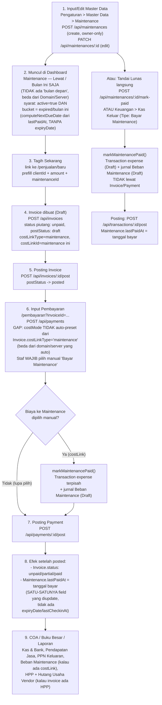

# Check-Flow — Maintenance

Alur nyata (dari kode, bukan asumsi) untuk 1 Maintenance: dari input master data sampai kehitung
di COA. Berbeda dari Domain/Server yang punya 2 jalur (Client / Internal), Maintenance **cuma
1 jalur** — `clientId` wajib diisi di schema (`String`, bukan `String?`), jadi tidak pernah ada
baris Maintenance tanpa Client. Maintenance juga TIDAK punya kolom `expiryDate` — jatuh tempo
selalu dihitung dari `lastPaidAt` + periode, tanpa anchor tersimpan seperti Domain/Server.

## Diagram

## Penjelasan tiap langkah

### 1. Input/Edit Master Data
- **Di mana:** Pengaturan → Master Data → tab Maintenance (`MasterDataPanel.tsx`, `MaintenanceSection`, ~line 705-990).
- **API:** `POST /api/maintenances` (`src/app/api/maintenances/route.ts:29-53`, owner-only, `prisma.maintenance.create`, wajib `name`+`clientId`) **DAN** `PATCH /api/maintenances/[id]` (`[id]/route.ts:6-29`).
- **Sama seperti Server:** bisa dibuat baru langsung dari UI ("Tambah Maintenance"), beda dari Domain yang cuma bisa diedit.
- **Field kunci:** `name`, `clientId` (WAJIB, tidak bisa Internal), `price`, `lastPaidAt` ("Tgl Tagihan Terakhir"), `active`. Field `periodId`/`periodCount` ADA di schema tapi **tidak ada di modal create/edit** — jadi siklus periode Maintenance efektif tidak bisa diatur lewat UI ini saat ini (kemungkinan diisi lewat data migrasi/seed, atau memang belum ada UI-nya).
- **BEDA DARI DOMAIN/SERVER:** tidak ada kolom `expiryDate` sama sekali di schema — jatuh tempo 100% dihitung dinamis dari `lastPaidAt + periode` (`computeNextDueDate`), tidak ada anchor tersimpan yang bisa dikoreksi manual seperti "Tgl Berakhir".

### 2. Muncul di Dashboard
- **Di mana:** `MaintenanceDueSection` (`src/components/dashboard/DashboardSections.tsx:703-800`), data dari `src/app/dashboard/page.tsx:159-174`.
- **Syarat tampil:** `active = true` DAN bucket `expired` ATAU `expiring_this_month` — **BEDA DARI DOMAIN/SERVER:** `expiring_next_month` sengaja DIKECUALIKAN (komentar eksplisit di kode: "beda dari Domain/Server, sengaja tidak ikut nampilin 'bulan depan' di sini"). UI filter pills juga cuma nampilin 2 opsi (`BUCKET_OPTIONS.slice(0, 2)`, `DashboardSections.tsx:792`), bukan 3.
- Karena `clientId` wajib, section ini TIDAK punya tombol "Tandai Lunas" varian Internal seperti Domain/Server — setiap baris pasti punya Client & tombol "Tagih Sekarang" (kalau HPP diisi) atau langsung "Tandai Lunas" kalau memang mau bayar tanpa tagihan formal (lihat jalur terpisah di bawah).

### 3-5. Tagih Sekarang, Invoice dibuat, Posting Invoice
- Sama persis mekanismenya dengan Domain/Server: link `/penjualan/baru?clientId=...&description=Maintenance ...&amount=...&maintenanceId=...` (`DashboardSections.tsx:773-777`), `POST /api/invoices` menyimpan `costLinkType: "maintenance"` + `costLinkId` (`src/app/api/invoices/route.ts:60-65`), lalu wajib `POST /api/invoices/:id/post` dulu.

### 6. Pembayaran (Pelunasan) — GAP PENTING vs Domain/Server
- **Di mana:** `/pembayaran?clientId=...&invoiceId=...` (`PembayaranForm.tsx`).
- **BEDA DARI DOMAIN/SERVER:** `PembayaranForm` **TIDAK** auto-preset cost-link "Bayar Maintenance" walau `Invoice.costLinkType === "maintenance"`. Komentar eksplisit di kode (`PembayaranForm.tsx:151-154`): auto-select cuma jalan untuk `costLinkType` `"domain"` atau `"server"` — `"maintenance"` sengaja/kebetulan dikecualikan, form ini belum punya UI auto-pick untuk itu. Staf **wajib pilih manual** "Bayar Maintenance" + maintenance-nya setiap kali, kalau lupa maintenance-nya TIDAK dianggap sudah ditagih ulang walau invoice-nya lunas.
- Kalau dipilih (manual): `markMaintenancePaid()` — bikin `Transaction` (expense, draft) + jurnal Beban Maintenance (`COA_CODE.bebanMaintenance`, kode `6-6000`) terpisah, `paymentId` sama dengan pelunasan invoice-nya.

### 7. Posting Payment
- **Di mana:** halaman `/pembayaran/[id]`, `PaymentPostingBar` — tombol "Posting".
- **API:** `POST /api/payments/:id/post`.
- Efek setelah posted (**paling simpel dari 3 modul ini**): kalau ada cost-link Maintenance, `finalizeTransactionPosting` (`mark-paid.ts:229-231`) cuma jalankan `tx.maintenance.update({ data: { lastPaidAt: transaction.occurredAt } })` — SATU field saja, tidak ada perhitungan anchor/expiry, tidak ada reset field lain (beda dari Server yang juga reset `lastCheckinAt`, dan Domain yang majukan `expiryDate`).

### 8. COA / Buku Besar / Laporan
- Sama persis strukturnya dengan Domain/Server, akun bebannya **Beban Maintenance** (`6-6000`).

### Jalur "Tandai Lunas" langsung (tanpa Invoice)
Walau Maintenance selalu punya Client, tetap ada jalur pintas tanpa lewat tagihan formal:
- **Tombol cepat:** "Tandai Lunas" di Master Data (bukan Dashboard seperti Domain/Server — cek `MasterDataPanel.tsx` Aksi kolom, muncul kalau `m.active && m.price`) → `POST /api/maintenances/:id/mark-paid` (wajib isi HPP + akun kas/bank).
- **Atau:** Keuangan → Kas Keluar → tambah baris dengan Tipe "Bayar Maintenance" → `POST /api/transactions/kas-keluar`.
- Keduanya manggil `markMaintenancePaid()` → `Transaction` expense (draft) + jurnal Beban Maintenance (draft) → diposting via `POST /api/transactions/:id/post` → `lastPaidAt` ke-update ke tanggal bayar.

## Yang perlu diwaspadai (bukan bug, tapi gampang salah paham)
1. **Maintenance TIDAK PERNAH "Internal"** — `clientId` wajib di schema, beda dari Domain/Server yang punya varian tanpa client.
2. **GAP paling penting:** form Pembayaran TIDAK auto-pilih "Bayar Maintenance" dari invoice `costLinkType`, padahal Domain/Server auto-pilih. Staf wajib ingat pilih manual, atau `lastPaidAt` Maintenance tidak akan maju walau invoice-nya sudah lunas.
3. **Tidak ada `expiryDate`** — jatuh tempo SELALU dihitung ulang dari `lastPaidAt` + periode saat itu juga (dinamis, bukan tersimpan), jadi bayar/tagih telat otomatis menggeser seluruh jadwal berikutnya dari tanggal bayar yang sebenarnya — tidak ada mekanisme "anchor lama" seperti Domain/Server.
4. **Dashboard cuma 2 bucket** (Lewat, Bulan Ini) — tidak ada peringatan dini "Bulan Depan" seperti Domain/Server.
5. Field `periodId`/`periodCount` ada di database tapi tidak ada di form create/edit Master Data — kalau perlu ubah siklus periode Maintenance, belum ada jalur UI resminya.
6. Invoice & Payment **draft tidak kehitung di mana pun** sampai eksplisit diposting — sama seperti Domain/Server.
