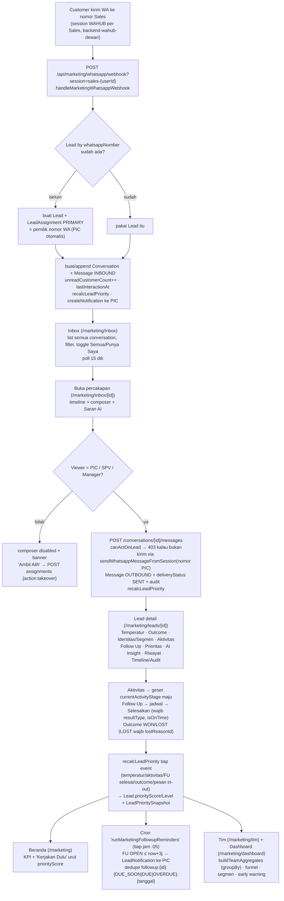

# Check-Flow — Marketing (Simple Lead)

Alur nyata (dari kode) modul **Marketing / Simple Lead** — dari pesan WhatsApp customer masuk
sampai jadi Won/Lost. Modul ini **terpisah** dari modul Internal (keuangan): gate lewat
`User.modules` (`"marketing"`), layout sendiri (`MarketingShell`), tidak menyentuh COA/jurnal
sama sekali.

> **Prinsip visibilitas (keputusan project, override `docs/06`):** semua anggota Tim
> (Manager/SPV/Sales) bisa **LIHAT semua lead + full chat**. Yang bisa **AKSI** (balas, ubah
> temperatur, aktivitas, follow up, outcome) cuma **PIC lead itu** atau **SPV/Manager**. Sales lain
> read-only sampai menekan **Ambil Alih**. Semua aksi tercatat di `AuditLog`.

## Diagram

## Penjelasan tiap langkah

### 1. Onboarding WhatsApp per Sales
- **Di mana:** `/marketing/whatsapp` (`ConnectWhatsapp.tsx`) — di luar route group `(shell)` supaya
  chrome-less. Tombol dari `MarketingShell` sidebar/menu.
- **API:** `connect` (`startWahubSession("sales-{userId}", webhookUrl)`), `qr`, `status` (poll),
  `disconnect`. Semua ke instance **`backend-wahub-dewari`** (`MARKETING_WAHUB_*`), BUKAN instance
  WAHUB Director Assistant.
- 1 Sales = 1 `WhatsappConnection` (`userId` `@unique`), `wahubSessionId` = bagian lokal
  `sales-{userId}` (WAHUB auto-prefix `{clientId}-`).

### 2. Pesan masuk → Lead / Conversation / Message
- **Fungsi:** `handleMarketingWhatsappWebhook` (`src/lib/marketing/whatsapp-webhook.ts`).
- Cari `WhatsappConnection` by `wahubSessionId` (query param `session`). Grup (`@g.us`) & pesan
  outgoing diabaikan.
- Lead by `whatsappNumber` (dinormalisasi ke `62…`). Lead baru → **`LeadAssignment` PRIMARY otomatis
  ke `connection.userId`** (pemilik nomor = PIC).
- `Conversation` di-namespace `providerConversationId = "{wahubSessionId}:{chatId}"` (customer sama
  bisa punya conversation beda ke tiap Sales).
- `Message` INBOUND, `unreadCustomerCount++`, `Lead.lastCustomerMessageAt`/`lastInteractionAt`.
- **Efek samping:** `recalcLeadPriority(lead.id)` + `createNotification` ke PIC (`dedupeKey`
  `newmsg:{conversationId}:{menit}` → burst chat tidak spam).
- **GAP diketahui:** payload WAHUB tidak bawa message-id, jadi **belum ada idempotency** di level
  pesan (retry webhook bisa dobel insert). `Message.providerMessageId` unik sudah disiapkan tapi
  belum diisi. Perlu diperbaiki begitu bentuk payload dewari dipastikan.

### 3. Inbox & Percakapan
- `GET /api/marketing/conversations` — `scope=all|mine`, `filter=all|unread|priority|hot`, `q`,
  `page`/`limit`. PIC + `canAct` di-batch (`actableLeadIds`), preview via `messages take:1`.
- `GET /conversations/[id]/messages` — 100 pesan terbaru + `beforeId`. Reset `unreadCustomerCount`
  **hanya kalau viewer = PIC**.
- `POST /conversations/[id]/messages` — `canActOnLead` → 403; kirim via
  `sendWhatsappMessageFromSession(conn.wahubSessionId, …)` (jadi SPV/Manager yang balas tetap
  terkirim **dari nomor PIC**). `deliveryStatus` berhenti di `"SENT"` (callback DELIVERED/READ dari
  WAHUB belum di-wire). Terima `aiSuggestionId` opsional → `Message.aiSuggestionId` + tandai
  suggestion `usedAt`/`usedByUserId`.
- Realtime = polling (inbox 15 dtk, percakapan 10 dtk). Tidak ada SSE/websocket.

### 4. Ambil Alih / Reassign (`POST /api/marketing/leads/[id]/assignments`)
- `action: "takeover"` → caller jadi PIC (**siapa pun anggota tim boleh**, tombol di banner non-PIC
  di `ConversationView` & `LeadDetailClient`).
- `action: "reassign"` → ke `assignedUserId`, **wajib `reason`**, hanya MANAGER/SPV atau PIC aktif.
- Transaction: `updateMany` tutup assignment lama (`isActive:false` + `endedAt`) → `create` baru
  (`assignmentType` `TAKEOVER`/`PRIMARY`) → `LeadNotification` ke PIC baru (`dedupeKey assign:{id}`)
  → audit.
- **`canActOnLead`** (`src/lib/marketing/permissions.ts`) = `true` kalau MANAGER/SPV
  (`resolveMarketingRole`: owner atau manajer Team aktif → MANAGER; `TeamMembership` role SPV → SPV)
  ATAU ada `LeadAssignment` aktif atas nama user itu (tipe apa pun).

### 5. Lead Management
- `GET /api/marketing/leads` — filter segmen/temp/tahap/outcome/prioritas/PIC + `sort` + toggle
  scope. Batch PIC / next-follow-up (`groupBy _min scheduledAt`) / `canAct` / `idleDays`.
- `GET /api/marketing/leads/[id]` — detail + `canAct` + `viewerRole` + `isCurrentPic` +
  `auditTrail` (40 `AuditLog` entityType lead/conversation).
- `PATCH` — edit identitas + `segmentId` (`canActOnLead` → 403). Ganti segmen → `LeadSegmentHistory`
  (transaction) + audit.
- **Temperatur** `POST /leads/[id]/temperature` — COLD/WARM/HOT, no-op kalau sama,
  `LeadTemperatureHistory`, `recalcLeadPriority`, audit.
- **Outcome** `POST /leads/[id]/outcome` — WON→`wonAt`; LOST→wajib `lostReasonId`+`lostAt`;
  OPEN→bersihkan. `recalcLeadPriority` (lead non-OPEN → skor 0/LOW).

### 6. Aktivitas & Follow Up
- **Aktivitas** `POST /leads/[id]/activities` — `canActOnLead`; geser `currentActivityStage` **maju
  saja** (rank NONE<DISCUSSION<ZOOM_DEMO<PROPOSAL<NEGOTIATION); `recalcLeadPriority`; audit.
- **Follow Up** `POST /leads/[id]/follow-ups` — `assignedUserId` default ke PIC. Status OPEN.
- **Selesaikan** `POST /follow-ups/[id]/complete` — wajib `resultTypeId`; `isOnTime` =
  `now ≤ scheduledAt + grace` (grace dari `LeadSystemSetting` `follow_up.grace_minutes`, default
  120, via `getFollowUpGraceMs`); opsi `next` → buat FU lanjutan + `nextFollowUpId` (transaction).
  `.../cancel` → CANCELLED.
- **Halaman `/marketing/follow-up`** — bucket **derived** dari status+scheduledAt (bukan kolom):
  Terlambat / Hari Ini / Akan Datang / Selesai. `GET /api/marketing/follow-ups` juga balikin
  `counts` scope-aware.
- **Cron** `runMarketingFollowupReminders` (`instrumentation.ts`, `"5 * * * *"` WIB) — FU OPEN ≤
  `now+3j` → `LeadNotification` ke `assignedUserId`, `dedupeKey`
  `followup:{id}:{DUE_SOON|DUE|OVERDUE}:{tanggal}` (`createMany skipDuplicates` → overdue re-remind
  1×/hari), set `reminderSentAt`.

### 7. Priority Engine (`src/lib/marketing/priority.ts`)
- `computeLeadPriority` — deterministik 0–100, bobot **Temperatur 25 / Aktivitas 30 / Hasil Follow
  Up 25 / Recency 10 / AI Signal 10**, `PRIORITY_RULE_VERSION = "v1"`.
  - Follow Up: `50 + LeadFollowUpResultType.priorityScoreEffect × 2` (clamp). Tanpa FU selesai → 40.
  - Recency: `100 − idleDays × 7`.
  - AI Signal: `LeadAiAnalysis` type `BUYING_SIGNAL` terbaru (`output.score`), default **0** sampai
    di-analisa.
  - Lead non-OPEN → langsung `{ score: 0, level: "LOW" }`.
- `recalcLeadPriority` update `Lead.priorityScore`/`priorityLevel` + insert `LeadPrioritySnapshot`
  (5 komponen + `reasonJson` string[]). Level: TOP≥80 / HIGH≥60 / MONITOR≥40 / LOW.
- **Trigger:** ubah temperatur, aktivitas baru, follow up selesai, ubah outcome, pesan masuk
  (webhook), pesan keluar. Backfill: `scripts/recalc-marketing-priority.ts`.

### 8. AI Analysis (`src/lib/marketing/ai.ts`, `@anthropic-ai/sdk`, `claude-haiku-4-5`)
- `analyzeLead(leadId)` — 1 call → 5 `LeadAiAnalysis` (SEGMENTATION, PROFILING, SUMMARY,
  NEXT_BEST_ACTION, BUYING_SIGNAL), versioned per tipe (`nextVersion`), status SUCCESS/FAILED.
  Endpoint `GET/POST /api/marketing/leads/[id]/ai` (POST gagal → **422, bukan 5xx** — UI tetap jalan).
- **Auto-apply segmentasi** hanya kalau `confidence ≥ ai.segment_auto_apply_confidence` (default 0.7)
  DAN `Lead.segmentId` masih null → set + `LeadSegmentHistory` source `AI`. Selain itu cuma
  rekomendasi.
- `suggestReplies(conversationId)` — 3 `LeadAiSuggestion` (PROFESSIONAL/CASUAL/CLOSING). `GET/POST
  /api/marketing/conversations/[id]/ai-suggestions`. **Tidak auto-send** — Sales pilih → isi
  composer → edit → kirim (`aiSuggestionId` ikut ke Message).
- BUYING_SIGNAL hasil analisa langsung mempengaruhi Priority (komponen AI 10%).

### 9. Notifikasi & Audit
- `createNotification` (`src/lib/marketing/notify.ts`) — `createMany skipDuplicates` by `dedupeKey`.
  Produser: cron follow-up, assignment (assign/takeover/reassign), pesan customer baru (webhook).
  **Ditarget ke PIC**, bukan broadcast.
- `GET/POST /api/marketing/notifications` — list 50 + `unreadCount`; mark `{id}` / `{all:true}`.
  `NotificationBell` di `MarketingShell` (badge, poll 30 dtk).
- **Web Push:** `sw.js` + `PushRegister` (subscribe kalau `VAPID_PUBLIC_KEY` ada). Endpoint
  `GET/POST/DELETE /api/marketing/push`. **Server-side send masih no-op** — butuh
  `npm i web-push` + `VAPID_PUBLIC_KEY`/`VAPID_PRIVATE_KEY` (lihat `sendWebPush`).
- **Timeline/Audit** di `LeadDetailClient` — `AuditLog` (append-only) dengan label Indonesia.

### 10. SPV & Manager
- `buildTeamAggregates` (`src/lib/marketing/analytics.ts`) — semua `groupBy`/`count` di DB, **tanpa
  loop query**. Per user: lead aktif, hot, FU hari ini/telat, chat belum dibalas, won bulan ini,
  on-time FU rate.
- `/marketing/tim` (`TeamBoard`) + `/marketing/tim/[userId]` (`MemberDetail`) + `/marketing/dashboard`
  (`ManagerDashboard`: KPI global, funnel tahap, performa segmen, performa tim).
- **Bukan gerbang akses** — semua anggota tim boleh buka; ini cara pandang teragregasi.
- Early warning: "N Hot Lead milik X belum di-follow up" (`followUps: { none: { status: "OPEN" } }`),
  "X punya ≥3 follow up terlambat".

### 11. Pengaturan & Tim
- `/marketing/settings` (MANAGER/owner untuk edit): tab **Umum** (tunable `LeadSystemSetting`) +
  **Tim** (`Team` + `TeamMembership`). Keluarkan member = soft (`activeUntil`).
- `resolveMarketingRole` baca MANAGER dari `User.role="owner"` / `Team.managerUserId`, SPV dari
  `TeamMembership.membershipRole="SPV"` (`activeUntil: null`).

## Yang perlu diwaspadai (bukan bug, gampang salah paham)

1. **Reply SPV/Manager terkirim dari nomor WA PIC**, bukan nomor mereka sendiri — karena
   `POST messages` selalu pakai `conversation.whatsappConnection` (nomor PIC). Kalau PIC belum
   scan WA / `whatsappConnection` null → 400 "belum terhubung".
2. **Webhook belum idempotent di level pesan** (lihat §2 GAP) — kalau WAHUB dewari retry, pesan bisa
   dobel. Prioritas fix begitu bentuk payload dipastikan.
3. **Delivery status mentok di SENT** — belum ada wiring callback DELIVERED/READ dari WAHUB.
4. **AI Signal default 0** untuk lead yang belum di-"Analisa AI" — jadi skor prioritas maksimum
   praktis ~90 sampai ada analisa. Bukan bug, memang butuh eksplisit.
5. **`recalcLeadPriority` dipanggil best-effort** di webhook & send message (`.catch(() => {})`) —
   kegagalan recalc tidak menggagalkan pesan. Snapshot bisa ketinggalan 1 event kalau error.
6. **Auto-apply segmentasi cuma sekali** — begitu `segmentId` terisi (manual atau AI), analisa AI
   berikutnya tidak menimpanya, cuma jadi rekomendasi.
7. **Cron follow-up reminder cuma bikin baris `LeadNotification`** — belum ada push/WA keluar
   (Fase 9 partial). Staf lihat lewat lonceng di app.
8. **`scope=mine` vs `all`** ada di hampir semua list — default: Inbox & Lead = `all` (transparan),
   Follow Up & Beranda = `mine`. Toggle selalu tersedia.

## File kunci

| Area | File |
|---|---|
| Izin & role | `src/lib/marketing/permissions.ts` |
| Audit | `src/lib/marketing/audit.ts` |
| Priority | `src/lib/marketing/priority.ts` |
| AI | `src/lib/marketing/ai.ts` |
| Notifikasi | `src/lib/marketing/notify.ts` |
| Follow up helper | `src/lib/marketing/follow-up.ts` |
| Agregat tim | `src/lib/marketing/analytics.ts` |
| Settings | `src/lib/marketing/settings.ts` |
| Webhook ingest | `src/lib/marketing/whatsapp-webhook.ts` |
| WAHUB client | `src/lib/wahub.ts` |
| Cron | `src/lib/cron/marketing-followup-reminders.ts` + `instrumentation.ts` |
| Shell/nav | `src/components/marketing/MarketingShell.tsx` |
| Halaman | `src/app/marketing/(shell)/**` (+ `/marketing/whatsapp` di luar grup) |
| Smoke test | `scripts/marketing-smoke.ts` |
| Seed lookup | `scripts/seed-marketing.ts` |
