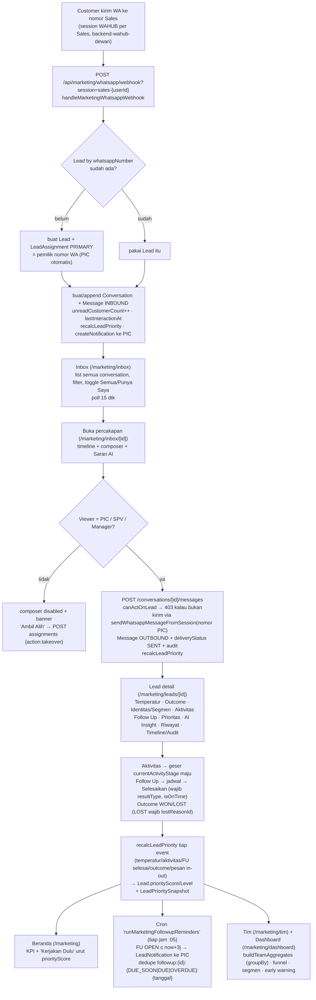

# Check-Flow — Marketing (Simple Lead)

Alur nyata (dari kode) modul **Marketing / Simple Lead** — dari pesan WhatsApp customer masuk
sampai jadi Won/Lost. Modul ini **terpisah** dari modul Internal (keuangan): gate lewat
`User.modules` (`"marketing"`), layout sendiri (`MarketingShell`), tidak menyentuh COA/jurnal
sama sekali.

> **Prinsip visibilitas (keputusan project, override `docs/06`):** semua anggota Tim
> (Manager/SPV/Sales) bisa **LIHAT semua lead + full chat**. Yang bisa **AKSI** (balas, ubah
> temperatur, aktivitas, follow up, outcome) cuma **PIC lead itu** atau **SPV/Manager**. Sales lain
> read-only sampai menekan **Ambil Alih**. Semua aksi tercatat di `AuditLog`.

## Diagram

## Penjelasan tiap langkah

### 1. Onboarding WhatsApp per Sales
- **Di mana:** `/marketing/whatsapp` (`ConnectWhatsapp.tsx`) — di luar route group `(shell)` supaya
  chrome-less. Tombol dari `MarketingShell` sidebar/menu.
- **API:** `connect` (`startWahubSession("sales-{userId}", webhookUrl)`), `qr`, `status` (poll),
  `disconnect`. Semua ke instance **`backend-wahub-dewari`** (`MARKETING_WAHUB_*`), BUKAN instance
  WAHUB Director Assistant.
- 1 Sales = 1 `WhatsappConnection` (`userId` `@unique`), `wahubSessionId` = bagian lokal
  `sales-{userId}` (WAHUB auto-prefix `{clientId}-`).

### 2. Pesan masuk → Lead / Conversation / Message
- **Fungsi:** `handleMarketingWhatsappWebhook` (`src/lib/marketing/whatsapp-webhook.ts`).
- Cari `WhatsappConnection` by `wahubSessionId` (query param `session`). Grup (`@g.us`) & pesan
  outgoing diabaikan.
- Lead by `whatsappNumber` (dinormalisasi ke `62…`). Lead baru → **`LeadAssignment` PRIMARY otomatis
  ke `connection.userId`** (pemilik nomor = PIC).
- `Conversation` di-namespace `providerConversationId = "{wahubSessionId}:{chatId}"` (customer sama
  bisa punya conversation beda ke tiap Sales).
- `Message` INBOUND, `unreadCustomerCount++`, `Lead.lastCustomerMessageAt`/`lastInteractionAt`.
- **Efek samping:** `recalcLeadPriority(lead.id)` + `createNotification` ke PIC (`dedupeKey`
  `newmsg:{conversationId}:{menit}` → burst chat tidak spam).
- **GAP diketahui:** payload WAHUB tidak bawa message-id, jadi **belum ada idempotency** di level
  pesan (retry webhook bisa dobel insert). `Message.providerMessageId` unik sudah disiapkan tapi
  belum diisi. Perlu diperbaiki begitu bentuk payload dewari dipastikan.

### 3. Inbox & Percakapan
- `GET /api/marketing/conversations` — `scope=all|mine`, `filter=all|unread|priority|hot`, `q`,
  `page`/`limit`. PIC + `canAct` di-batch (`actableLeadIds`), preview via `messages take:1`.
- `GET /conversations/[id]/messages` — 100 pesan terbaru + `beforeId`. Reset `unreadCustomerCount`
  **hanya kalau viewer = PIC**.
- `POST /conversations/[id]/messages` — `canActOnLead` → 403; kirim via
  `sendWhatsappMessageFromSession(conn.wahubSessionId, …)` (jadi SPV/Manager yang balas tetap
  terkirim **dari nomor PIC**). `deliveryStatus` berhenti di `"SENT"` (callback DELIVERED/READ dari
  WAHUB belum di-wire). Terima `aiSuggestionId` opsional → `Message.aiSuggestionId` + tandai
  suggestion `usedAt`/`usedByUserId`.
- Realtime = polling (inbox 15 dtk, percakapan 10 dtk). Tidak ada SSE/websocket.

### 4. Ambil Alih / Reassign (`POST /api/marketing/leads/[id]/assignments`)
- `action: "takeover"` → caller jadi PIC (**siapa pun anggota tim boleh**, tombol di banner non-PIC
  di `ConversationView` & `LeadDetailClient`).
- `action: "reassign"` → ke `assignedUserId`, **wajib `reason`**, hanya MANAGER/SPV atau PIC aktif.
- Transaction: `updateMany` tutup assignment lama (`isActive:false` + `endedAt`) → `create` baru
  (`assignmentType` `TAKEOVER`/`PRIMARY`) → `LeadNotification` ke PIC baru (`dedupeKey assign:{id}`)
  → audit.
- **`canActOnLead`** (`src/lib/marketing/permissions.ts`) = `true` kalau MANAGER/SPV
  (`resolveMarketingRole`: owner atau manajer Team aktif → MANAGER; `TeamMembership` role SPV → SPV)
  ATAU ada `LeadAssignment` aktif atas nama user itu (tipe apa pun).

### 5. Lead Management
- `GET /api/marketing/leads` — filter segmen/temp/tahap/outcome/prioritas/PIC + `sort` + toggle
  scope. Batch PIC / next-follow-up (`groupBy _min scheduledAt`) / `canAct` / `idleDays`.
- `GET /api/marketing/leads/[id]` — detail + `canAct` + `viewerRole` + `isCurrentPic` +
  `auditTrail` (40 `AuditLog` entityType lead/conversation).
- `PATCH` — edit identitas + `segmentId` (`canActOnLead` → 403). Ganti segmen → `LeadSegmentHistory`
  (transaction) + audit.
- **Temperatur** `POST /leads/[id]/temperature` — COLD/WARM/HOT, no-op kalau sama,
  `LeadTemperatureHistory`, `recalcLeadPriority`, audit.
- **Outcome** `POST /leads/[id]/outcome` — WON→`wonAt`; LOST→wajib `lostReasonId`+`lostAt`;
  OPEN→bersihkan. `recalcLeadPriority` (lead non-OPEN → skor 0/LOW).

### 6. Aktivitas & Follow Up
- **Aktivitas** `POST /leads/[id]/activities` — `canActOnLead`; geser `currentActivityStage` **maju
  saja** (rank NONE<DISCUSSION<ZOOM_DEMO<PROPOSAL<NEGOTIATION); `recalcLeadPriority`; audit.
- **Follow Up** `POST /leads/[id]/follow-ups` — `assignedUserId` default ke PIC. Status OPEN.
- **Selesaikan** `POST /follow-ups/[id]/complete` — wajib `resultTypeId`; `isOnTime` =
  `now ≤ scheduledAt + grace` (grace dari `LeadSystemSetting` `follow_up.grace_minutes`, default
  120, via `getFollowUpGraceMs`); opsi `next` → buat FU lanjutan + `nextFollowUpId` (transaction).
  `.../cancel` → CANCELLED.
- **Halaman `/marketing/follow-up`** — bucket **derived** dari status+scheduledAt (bukan kolom):
  Terlambat / Hari Ini / Akan Datang / Selesai. `GET /api/marketing/follow-ups` juga balikin
  `counts` scope-aware.
- **Cron** `runMarketingFollowupReminders` (`instrumentation.ts`, `"5 * * * *"` WIB) — FU OPEN ≤
  `now+3j` → `LeadNotification` ke `assignedUserId`, `dedupeKey`
  `followup:{id}:{DUE_SOON|DUE|OVERDUE}:{tanggal}` (`createMany skipDuplicates` → overdue re-remind
  1×/hari), set `reminderSentAt`.

### 7. Priority Engine (`src/lib/marketing/priority.ts`) — sesuai `docs/06 §11-§14`
- `computeLeadPriority(input, weights)` — deterministik 0–100. Bobot default **Temperatur 25 /
  Aktivitas 30 / Hasil Follow Up 25 / Recency 10 / AI Signal 10**, bisa di-override di
  `/marketing/settings` (`priority.weight_*`, dinormalisasi total 1). `ruleVersion` = `priority-v1`
  (atau `priority-v1-custom` kalau bobot diubah).
  - Temperatur: COLD 30 / WARM 60 / HOT 90 (§11.1).
  - Aktivitas: `LeadActivityType.score` (seed 20/55/75/90, §7).
  - Follow Up: `LeadFollowUpResultType.normalizedScore` 0–100 (seed REQUEST_PROPOSAL 100 …
    NOT_INTERESTED 0, §8). Tanpa FU selesai → **50** (§11.3).
  - Recency: step-table `<24j=100 · 1-2h=80 · 3-4h=60 · 5-7h=40 · >7h=20` (§10). **Exception:** ada
    follow up OPEN di masa depan → recency ditahan minimal 80 (idle penalty tidak jalan).
  - AI Signal: `LeadAiAnalysis` BUYING_SIGNAL terbaru, default **neutral 50** (§11.5).
  - **Modifier** (§12) setelah base: follow-up due `≤2j +5` / overdue `+10` / `>24j +15`;
    customer waiting (pesan terakhir INBOUND belum dibalas) `<SLA +5` / `>SLA +10`
    (SLA = `escalation.hot_unreplied_hours`). Clamp 0–100.
  - Lead non-OPEN → `{ score: 0, level: "LOW" }`. Level: TOP≥80 / HIGH≥60 / MONITOR≥40 / LOW.
- `recalcLeadDerived(leadId)` (`src/lib/marketing/recalc.ts`) = priority **+** saran temperatur
  (§8). Dipanggil di: ubah temperatur/outcome, aktivitas baru, follow up selesai, pesan
  masuk (webhook), pesan keluar, AI analysis. Backfill: `scripts/recalc-marketing-priority.ts`.

### 7b. Temperature Signal Score (`src/lib/marketing/temperature.ts`) — `docs/06 §4-§6`
- `computeTemperatureSignal` — 0–100: AI Buying Interest 30 / Need 20 / Activity 25 / Follow Up 15 /
  Recency 10. Mapping 0-39 COLD / 40-69 WARM / 70-100 HOT.
- **Strong signal** (§5: stage PROPOSAL/NEGOTIATION atau hasil FU REQUEST_PROPOSAL/REQUEST_DEMO) →
  langsung menyarankan HOT.
- Mode **SUGGEST_ONLY** — sistem TIDAK pernah ubah `Lead.temperature` otomatis. `recomputeTemperatureSuggestion`
  simpan `LeadAiAnalysis` type `TEMPERATURE_RECOMMENDATION` (`modelName: "rule"`). UI detail lead:
  "Saran: HOT (78) — [Terapkan]".
- **Manual override lock** (§6): ubah temperatur manual → `Lead.temperatureLockedUntil = now +
  temperature.override_lock_hours` (24 jam). Selama lock, UI tampilkan "lock manual s/d …".

### 8. AI Analysis (`src/lib/marketing/ai.ts`, `@anthropic-ai/sdk`)
- Model: **`claude-haiku-4-5`** (`AI_MODEL_FAST`) untuk cron auto-reanalysis & saran balasan;
  **`claude-sonnet-5`** (`AI_MODEL_DEEP`) untuk tombol "Analisa AI" manual.
- `analyzeLead(leadId, { model })` — 1 call → 5 `LeadAiAnalysis` (SEGMENTATION, PROFILING, SUMMARY,
  NEXT_BEST_ACTION, BUYING_SIGNAL), versioned per tipe, status SUCCESS/FAILED. Endpoint
  `GET/POST /api/marketing/leads/[id]/ai` (POST gagal → **422**, UI tetap jalan).
- **Auto-apply segmentasi** (`shouldAutoApplySegment` di `rules.ts`): `confidence ≥
  ai.segment_auto_apply_confidence` (default **0.85**, `docs/06 §2.2`) DAN `Lead.segmentId` null →
  set + `LeadSegmentHistory` source `AI`. Koreksi manual selalu menang.
- **Auto-reanalysis** (`src/lib/cron/marketing-ai-reanalysis.ts`, cron tiap 10 mnt) — lead OPEN
  dengan `lastInteractionAt` baru sejak analisa AI terakhir, batch 12, model Haiku (`docs/02 §19`).
- `suggestReplies` — 3 `LeadAiSuggestion`. **Tidak auto-send** — pilih → composer → edit → kirim
  (`aiSuggestionId` ikut ke `Message`, `usedAt`/`usedByUserId` keset).

### 9. Notifikasi, Escalation & Audit
- `createNotification` (`src/lib/marketing/notify.ts`) — `createMany skipDuplicates` by `dedupeKey`.
  Produser: cron follow-up + escalation, assignment, pesan customer baru (webhook). Ditarget ke PIC
  (+ atasan untuk escalation).
- **Escalation ke SPV/Manager** (`src/lib/marketing/escalation.ts`, cron tiap jam :05, `docs/06 §18`):
  hot lead belum dibalas > `escalation.hot_unreplied_hours` (2j) · follow up overdue >
  `escalation.followup_overdue_hours` (24j) · negosiasi idle > `escalation.negotiation_idle_days`
  (3h) → notif ke PIC + `TeamMembership.supervisorUserId` + `Team.managerUserId`, dedupe harian.
- **Working Hours** (`src/lib/marketing/working-hours.ts`, `docs/06 §33`): Sen–Jum + Sabtu(toggle),
  08–17 WIB; `workingMsBetween` dipakai Avg Response Time KPI. Nonaktif → wall clock.
- `GET/POST /api/marketing/notifications` — list 50 + `unreadCount`; mark `{id}` / `{all:true}`.
  `NotificationBell` di `MarketingShell` (badge, poll 30 dtk).
- **Web Push:** `sw.js` + `PushRegister` (subscribe kalau `VAPID_PUBLIC_KEY` ada). Endpoint
  `GET/POST/DELETE /api/marketing/push`. **Server-side send masih no-op** — butuh
  `npm i web-push` + `VAPID_PUBLIC_KEY`/`VAPID_PRIVATE_KEY` (lihat `sendWebPush`).
- **Timeline/Audit** di `LeadDetailClient` — `AuditLog` (append-only) dengan label Indonesia.

### 10. SPV & Manager
- `buildTeamAggregates` (`src/lib/marketing/analytics.ts`) — semua `groupBy`/`count` di DB, **tanpa
  loop query**. Per user: lead aktif, hot, FU hari ini/telat, chat belum dibalas, won bulan ini,
  on-time FU rate.
- `/marketing/tim` (`TeamBoard`) + `/marketing/tim/[userId]` (`MemberDetail` — tab Ringkasan/Leads/
  Follow Up/Aktivitas) + `/marketing/dashboard` (`ManagerDashboard`).
- Dashboard: KPI global + **Avg Response Time** (working-hours aware, `src/lib/marketing/kpi.ts`) +
  **Conversion** (Lead→Hot / Proposal / Negotiation / Win rate, `docs/06 §22`) + funnel tahap +
  performa segmen (hot/won/lost/win-rate) + performa tim. **Filter:** periode (`from`/`to`) + segmen.
- **Bukan gerbang akses** — semua anggota tim boleh buka; cara pandang teragregasi.
- Early warning: "N Hot Lead milik X belum di-follow up", "X punya ≥3 follow up terlambat".

### 11. Pengaturan & Tim
- `/marketing/settings` (MANAGER/owner untuk edit): tab **Umum** (tunable `LeadSystemSetting` +
  5 bobot Priority), **Master Data** (CRUD Segmentasi / Sumber Lead / Jenis Aktivitas / Hasil
  Follow Up / Alasan LOST — `MarketingMasterList`), **Tim** (`Team` + `TeamMembership`, keluarkan
  member = soft `activeUntil`).
- Semua default tunable di `MARKETING_SETTING_DEFAULTS` (`src/lib/marketing/settings.ts`).
- `resolveMarketingRole` baca MANAGER dari `User.role="owner"` / `Team.managerUserId`, SPV dari
  `TeamMembership.membershipRole="SPV"` (`activeUntil: null`).

### 12. Lead manual & Won/Lost
- **Tambah Lead manual** (`POST /api/marketing/leads`) — tombol di `/marketing/leads`; nama + no WA
  wajib, cek duplikat nomor → 409, pembuat jadi PIC.
- **Won** (`POST /leads/[id]/outcome` `outcome:"WON"`) — form tanggal deal + nilai deal Rp
  (`Lead.dealValue`) + catatan (`Lead.wonNote`); auto-cancel semua follow up OPEN (`docs/06 §25`).
- **Lost** — wajib `lostReasonId`; auto-cancel follow up OPEN (§26).
- **Buka Kembali** (reopen, §27) — `outcome:"OPEN"` dari WON/LOST → bersihkan won/lost, recompute
  temperatur, audit `marketing.lead.reopen`.

### 13. Cron modul Marketing (`instrumentation.ts`, WIB)
| Jadwal | Fungsi | Isi |
|---|---|---|
| `5 * * * *` | `runMarketingFollowupReminders` | notif follow up due/overdue ke PIC (dedupe harian) |
| `5 * * * *` | `runMarketingEscalations` | escalation hot-unreplied / fu-overdue / negosiasi-idle ke PIC+atasan |
| `*/10 * * * *` | `runMarketingAiReanalysis` | analisa AI ulang lead OPEN yang ada interaksi baru (Haiku, batch 12) |

### 14. Test
- `npm test` → vitest. `src/lib/marketing/__tests__/business-rules.test.ts` — 25 acceptance test
  `docs/06 §40` (Priority Engine, temperature signal, `advanceStage`, `shouldAutoApplySegment`,
  follow-up bucket). `scripts/marketing-smoke.ts` = smoke test wiring end-to-end ke DB.

## Yang perlu diwaspadai (bukan bug, gampang salah paham)

1. **Reply SPV/Manager terkirim dari nomor WA PIC**, bukan nomor mereka sendiri — karena
   `POST messages` selalu pakai `conversation.whatsappConnection` (nomor PIC). Kalau PIC belum
   scan WA / `whatsappConnection` null → 400 "belum terhubung".
2. **Webhook belum idempotent di level pesan** — kalau WAHUB dewari retry, pesan bisa dobel
   (`Message.providerMessageId` disiapkan tapi belum diisi). Fix begitu bentuk payload dipastikan.
3. **Delivery status mentok di SENT** — belum ada wiring callback DELIVERED/READ dari WAHUB.
4. **AI Signal default 50 (neutral)** untuk lead yang belum di-"Analisa AI" (`docs/06 §11.5`).
   Temperature signal juga pakai default netral 50 untuk AI interest/need.
5. **`recalcLeadDerived` dipanggil best-effort** (`.catch(() => {})`) — kegagalan recalc priority/
   temperatur tidak menggagalkan aksi user. Snapshot bisa ketinggalan 1 event kalau error.
6. **Auto-apply segmentasi cuma sekali** — begitu `segmentId` terisi, analisa AI berikutnya cuma
   jadi rekomendasi (koreksi manual menang, `docs/06 §2.3`). Threshold **0.85**.
7. **Notifikasi cuma baris `LeadNotification`** — Web Push server-side belum jalan (butuh `web-push`
   + VAPID). Staf lihat lewat lonceng di app (poll 30 dtk).
8. **Temperature = SUGGEST_ONLY** — sistem tidak pernah auto-ubah `Lead.temperature`. Mode
   `AUTO_WITH_GUARDRAIL` belum diimplementasi.
9. **`scope=mine` vs `all`** — default: Inbox & Lead = `all` (transparan), Follow Up & Beranda =
   `mine`. Toggle selalu tersedia.
10. **Response Time & KPI working-hours aware** hanya kalau `working_hours.enabled = 1`. Kalau 0,
    pakai wall-clock 24/7.

## File kunci

| Area | File |
|---|---|
| Izin & role | `src/lib/marketing/permissions.ts` |
| Audit | `src/lib/marketing/audit.ts` |
| Priority Engine | `src/lib/marketing/priority.ts` |
| Temperature Signal | `src/lib/marketing/temperature.ts` |
| Recalc gabungan | `src/lib/marketing/recalc.ts` |
| Rule pure (test) | `src/lib/marketing/rules.ts` |
| AI | `src/lib/marketing/ai.ts` |
| Notifikasi | `src/lib/marketing/notify.ts` |
| Escalation | `src/lib/marketing/escalation.ts` |
| Working hours | `src/lib/marketing/working-hours.ts` |
| KPI (response time / conversion) | `src/lib/marketing/kpi.ts` |
| Follow up helper | `src/lib/marketing/follow-up.ts` |
| Agregat tim | `src/lib/marketing/analytics.ts` |
| Settings | `src/lib/marketing/settings.ts` |
| Webhook ingest | `src/lib/marketing/whatsapp-webhook.ts` |
| WAHUB client | `src/lib/wahub.ts` |
| Cron | `src/lib/cron/marketing-followup-reminders.ts`, `marketing-ai-reanalysis.ts`, `escalation.ts` + `instrumentation.ts` |
| Shell/nav + UI shared | `src/components/marketing/MarketingShell.tsx`, `src/components/marketing/ui.tsx` |
| Halaman | `src/app/marketing/(shell)/**` (+ `/marketing/whatsapp` di luar grup) |
| Test | `npm test` → `src/lib/marketing/__tests__/business-rules.test.ts` · `scripts/marketing-smoke.ts` |
| Seed lookup | `scripts/seed-marketing.ts` · backfill priority `scripts/recalc-marketing-priority.ts` |
