# Check-Flow — Server

Alur nyata (dari kode, bukan asumsi) untuk 1 Server: dari input master data sampai kehitung di
COA. Server punya **2 jalur berbeda** tergantung `clientId`-nya diisi atau tidak — sama polanya
dengan Domain (lihat `Check-Flow.MD`), tapi ada beberapa perbedaan penting di bagian tanggal
jatuh tempo — ditandai **BEDA DARI DOMAIN** di bawah.

## Diagram

```mermaid
flowchart TD
  A["1. Input/Edit Master Data\nPengaturan > Master Data > Server\nPOST /api/servers (create, owner-only)\nPATCH /api/servers/:id (edit)"] --> B{clientId diisi?}

  B -- "Ya, milik Client" --> C["2. Muncul di Dashboard\nServer — Lewat / Bulan Ini / Bulan Depan\nsyarat: active=true DAN\nbucket = expired/bulan ini/bulan depan\n(dari lastPaidAt + BillingPeriod, computeNextDueDate)"]
  C --> D["3. Tagih Sekarang\nlink ke /penjualan/baru\nprefill clientId + amount + serverId"]
  D --> E["4. Invoice dibuat (Draft)\nPOST /api/invoices\nstatus piutang: unpaid, postStatus: draft\ncostLinkType=server, costLinkId=server ini"]
  E --> F["5. Posting Invoice\nPOST /api/invoices/:id/post\npostStatus -> posted\n(HPP invoice, kalau ada, ikut posted)"]
  F --> G["6. Input Pembayaran\n/pembayaran?invoiceId=...\nPOST /api/payments\n(Payment + Transaction + Jurnal, semua Draft)\ncostMode+costLinkId AUTO terisi dari Invoice.costLinkType/Id"]
  G --> G2{"Biaya ke Server\nkepilih? (auto kalau dari\nTagih Sekarang, manual\nkalau invoice dibuat lain)"}
  G2 -- "Ya (costLink)" --> G3["markServerPaid()\nTransaction expense terpisah\n+ jurnal Beban Server/Hosting (Draft)"]
  G2 -- "Tidak" --> H
  G3 --> H["7. Posting Payment\nPOST /api/payments/:id/post\nsemua Transaction terkait\ndi-posting bareng"]
  H --> I["8. Efek setelah posted:\n- Invoice.status: unpaid/partial/paid\n- Server.lastPaidAt = tanggal bayar\n  (BEDA DARI DOMAIN: TIDAK ada expiryDate,\n  jatuh tempo berikutnya = lastPaidAt + periode)"]
  I --> J["9. COA / Buku Besar / Laporan\nJurnal postStatus=posted dihitung:\nKas & Bank, Pendapatan Jasa, PPN Keluaran,\nBeban Server/Hosting (kalau ada costLink),\nHPP + Hutang Usaha Vendor (kalau invoice ada HPP)"]

  B -- "Tidak, Internal (7Smarts sendiri)" --> K["2b. Muncul di Dashboard\nkolom Aksi: tombol 'Tandai Lunas'\n(bukan Tagih Sekarang)"]
  K --> L["3b. Tandai Lunas\nPOST /api/servers/:id/mark-paid\nATAU lewat Keuangan > Kas Keluar\n(Tipe baris: Bayar Server)"]
  L --> M["4b. markServerPaid()\nTransaction expense (Draft)\n+ jurnal Beban Server/Hosting (Draft)\nTIDAK lewat Invoice/Payment sama sekali"]
  M --> N["5b. Posting\nPOST /api/transactions/:id/post"]
  N --> O["6b. Efek setelah posted:\nServer.lastPaidAt = tanggal bayar, lastCheckinAt di-reset\nBeban Server/Hosting masuk COA"]
```

## Penjelasan tiap langkah

### 1. Input/Edit Master Data
- **Di mana:** Pengaturan → Master Data → tab Server (`MasterDataPanel.tsx`, `ServerSection`).
- **API:** `POST /api/servers` (`src/app/api/servers/route.ts`, owner-only, `prisma.server.create`) **DAN** `PATCH /api/servers/[id]`.
- **BEDA DARI DOMAIN:** Server BISA dibuat baru langsung dari UI ("Tambah Server") — Domain cuma bisa diedit, tidak ada create sama sekali.
- **Field kunci:** `name`, `ipAddress`, `vendorId`, `cloudTypeId`, `clientId` (kosong = Internal/7Smarts), `core`/`ram`/`storage`, `price` (harga jual ke client — **bukan `sellPrice` seperti Domain**, nama fieldnya beda), `periodId`+`periodCount` (siklus tagihan: Bulanan/Tahunan/dst, lewat relasi `BillingPeriod`), `lastPaidAt`, `active`.
- **BEDA DARI DOMAIN:** Server **tidak punya kolom `expiryDate`** sama sekali. Jatuh tempo berikutnya SELALU dihitung dinamis dari `lastPaidAt + periode` (`computeNextDueDate`, `src/lib/recurring-bill-status.ts:14-24` — fungsi yang sama dipakai Maintenance & RecurringBill), bukan tanggal anchor tersimpan seperti `Domain.expiryDate`.

### 2. Muncul di Dashboard
- **Di mana:** `ServerDueSection` (`src/components/dashboard/DashboardSections.tsx:558-666`), data dari `src/app/dashboard/page.tsx:139-158`.
- **Syarat tampil:** `active = true` DAN bucket-nya `expired` / `expiring_this_month` / `expiring_next_month` — logika bucket (`getExpiryBucket`, `src/lib/domain-status.ts`) SAMA dengan Domain, tapi tanggal yang dipakai beda: Server pakai `computeNextDueDate(lastPaidAt, period.name, periodCount)`, Domain pakai `resolveDomainExpiry` (expiryDate tersimpan).
- Kolom Pemilik/Aksi sama persis strukturnya dengan Domain (WA follow-up, "Tagih Sekarang" untuk client, "Tandai Lunas" untuk internal).

### 3. Jadi Tagihan (jalur Client)
- Klik "Tagih Sekarang" → `/penjualan/baru?clientId=...&description=Perpanjangan server ...&amount=...&serverId=...` (`DashboardSections.tsx:639-645`) — bentuknya identik dengan Domain, cuma `serverId` ganti `domainId`.

### 4-5. Invoice dibuat & Posting Invoice
- Sama persis dengan Domain: `POST /api/invoices` menyimpan `costLinkType: "server"` + `costLinkId` (`src/app/api/invoices/route.ts:59-62`), lalu wajib `POST /api/invoices/:id/post` dulu sebelum bisa dibayar.

### 6. Pembayaran (Pelunasan)
- **Di mana:** `/pembayaran?clientId=...&invoiceId=...` (`PembayaranForm.tsx`).
- Sama persis dengan Domain: `PembayaranForm` baca `Invoice.costLinkType`/`costLinkId`, auto-preset `costMode: "server"` + `costLinkId` kalau invoice-nya dari "Tagih Sekarang". Opsi cost-link (Bayar Domain/Server) sama-sama **owner-only**.
- **Kaitkan biaya ke Server:** memicu `markServerPaid()` — bikin `Transaction` (expense, draft) + jurnal Beban Server/Hosting (`COA_CODE.bebanServerHosting`, kode `6-4000` — beda dari Beban Domain `6-5000`) terpisah, tetap 1 `paymentId` yang sama.
- **Kalau tidak ada cost-link sama sekali**, pembayaran invoice tetap sukses, tapi `Server.lastPaidAt` **tidak ikut ter-update** — sama seperti Domain, memang harus eksplisit dikaitkan.

### 7. Posting Payment
- **Di mana:** halaman `/pembayaran/[id]`, `PaymentPostingBar` — tombol "Posting".
- **API:** `POST /api/payments/:id/post` → semua `Transaction` terkait di-posting sekaligus.
- Efek setelah posted:
  - `Invoice.status` dihitung ulang: `unpaid` → `partial`/`paid`.
  - Kalau ada cost-link Server: `Server.lastPaidAt` di-update ke `occurredAt` transaksi itu, dan `lastCheckinAt` di-reset ke `null` (`finalizeTransactionPosting`, `src/lib/accounting/mark-paid.ts:211-212`).
  - **BEDA PENTING DARI DOMAIN:** tidak ada field `expiryDate` yang di-maju-kan — jatuh tempo berikutnya otomatis "ikut" `lastPaidAt` yang baru + periode. Artinya kalau bayarnya telat, siklus jatuh tempo berikutnya IKUT MUNDUR dari tanggal bayar sebenarnya (bukan tetap dari jatuh tempo lama seperti Domain, yang sengaja +1 tahun dari `expiryDate` lama supaya telat bayar tidak menggeser siklus).

### 8. COA / Buku Besar / Laporan
- Sama persis strukturnya dengan Domain, cuma akun bebannya beda: **Beban Server/Hosting** (`6-4000`) menggantikan Beban Domain.

### Jalur Internal (tanpa Client)
Server internal (7Smarts sendiri) tidak pernah masuk Invoice/Piutang/Payment sama sekali:
- **Tombol cepat:** "Tandai Lunas" di Dashboard → `POST /api/servers/:id/mark-paid` (wajib isi HPP + akun kas/bank) — sama pola dengan Domain.
- **Atau:** Keuangan → Kas Keluar → tambah baris dengan Tipe "Bayar Server" → `POST /api/transactions/kas-keluar`.
- Keduanya manggil `markServerPaid()` → `Transaction` expense (draft) + jurnal Beban Server/Hosting (draft) → diposting via `POST /api/transactions/:id/post` → `lastPaidAt` ke-update ke tanggal bayar (TANPA logika +1 tahun dari expiry lama, karena memang tidak ada `expiryDate` untuk Server).

## Yang perlu diwaspadai (bukan bug, tapi gampang salah paham)
1. **Server BISA dibuat baru dari Master Data, Domain TIDAK** — kalau staf baru terbiasa dari alur Domain (yang cuma edit), jangan bingung kenapa Server ada tombol "Tambah Server".
2. **Renewal Server "reset" dari tanggal bayar aktual, bukan dari jatuh tempo lama** — beda dengan Domain yang sengaja +1 tahun dari `expiryDate` lama supaya telat bayar tidak menggeser siklus tahun depan. Kalau staf telat input pembayaran Server, jatuh tempo berikutnya ikut mundur sesuai tanggal bayar yang sebenarnya diinput, bukan tanggal jatuh tempo yang seharusnya.
3. **"Tagih Sekarang" otomatis mengaitkan Server ke invoice-nya** (lewat `Invoice.costLinkType`/`costLinkId`) — invoice yang dibuat manual tidak punya link ini, staf wajib pilih sendiri "Bayar Server" di form Pembayaran kalau tidak `lastPaidAt` Server tetap tanggal lama walau invoice-nya sudah lunas.
4. Invoice & Payment **draft tidak kehitung di mana pun** sampai eksplisit diposting — dua langkah posting terpisah (Invoice, lalu Payment) wajib berurutan, sama seperti Domain.
5. Field harga jual namanya **`price`**, bukan `sellPrice` seperti di Domain — cuma beda nama kolom di database, fungsinya sama (harga yang ditagihkan ke client & dipakai isi nominal "Tagih Sekarang").
