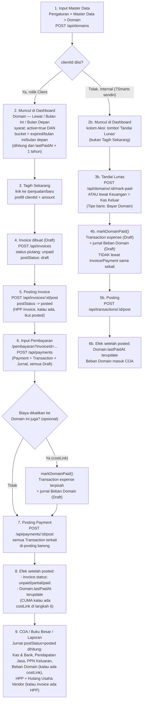

# Check-Flow — Domain

Alur nyata (dari kode, bukan asumsi) untuk 1 Domain: dari input master data sampai kehitung di
COA. Domain punya **2 jalur berbeda** tergantung `clientId`-nya diisi atau tidak — keduanya
dijelaskan di bawah.

## Diagram

## Penjelasan tiap langkah

### 1. Input Master Data
- **Di mana:** Pengaturan → Master Data → tab Domain (`MasterDataPanel.tsx`).
- **API:** `POST /api/domains`.
- **Field kunci:** `name`, `clientId` (kosong = Internal/7Smarts), `sellPrice` (harga jual ke client), `lastPaidAt`, `active`.
- Domain **tidak punya field expiry eksplisit** — tanggal habis selalu dihitung ulang:
  `computeDomainExpiryDate(lastPaidAt) = lastPaidAt + 1 tahun` (`src/lib/domain-status.ts`).

### 2. Muncul di Dashboard
- **Di mana:** `DomainExpiringSection` (`src/components/dashboard/DashboardSections.tsx`), data dari `src/app/dashboard/page.tsx`.
- **Syarat tampil:** `active = true` DAN bucket-nya `expired` / `expiring_this_month` / `expiring_next_month` (domain yang masih "aman" tidak ditampilkan di section ini).
- Kolom **Pemilik** menampilkan nama client + PIC + No. WA + tombol follow-up WA (kalau ada `clientId`); kalau Internal cuma tampil "Internal".
- Kolom **Aksi** beda tergantung `clientId`:
  - Ada client → tombol **"Tagih Sekarang"**.
  - Internal → tombol **"Tandai Lunas"** (kalau Owner).

### 3. Jadi Tagihan (jalur Client)
- Klik "Tagih Sekarang" → `/penjualan/baru?clientId=...&description=Perpanjangan domain ...&amount=...` (cuma prefill, **belum otomatis nyambung ke Domain-nya secara struktural**).
- Submit form → `POST /api/invoices` → bikin `Invoice` (default `postStatus: "draft"`, `status: "unpaid"`) + `InvoiceLine`.
- **Cash-basis:** piutang/pendapatan BELUM diakui di titik ini. Kalau baris invoice diisi `unitCost` (HPP), langsung dibuat 1 jurnal HPP (`invoiceCostLines`): debit HPP, kredit Hutang Usaha Vendor — tapi statusnya **draft**, baru berlaku setelah invoice-nya diposting.

### 4. Posting Invoice
- **Di mana:** halaman `/penjualan/[id]`, tombol **"Posting Invoice"** (`InvoicePostButton`) — cuma muncul kalau `postStatus = draft`.
- **API:** `POST /api/invoices/:id/post` → `postStatus: draft → posted`, jurnal HPP (kalau ada) ikut difinalkan.
- **Penting:** selama masih draft, invoice ini **tidak muncul** di daftar pilihan invoice pada form Pembayaran (`PembayaranForm` cuma fetch `?postStatus=posted`) — jadi wajib diposting dulu sebelum bisa dibayar.

### 5. Pembayaran (Pelunasan)
- **Di mana:** `/pembayaran?clientId=...&invoiceId=...` (`PembayaranForm.tsx`).
- **API:** `POST /api/payments` → bikin `Payment` (draft) + per baris invoice: `Transaction` (income, draft) + `InvoicePayment` + jurnal (`invoicePaymentLines`: debit Kas/Bank, kredit Pendapatan Jasa, kredit PPN Keluaran kalau ada PPN) — **titik ini pendapatan baru diakui** (cash-basis).
- **Opsional — kaitkan biaya ke Domain:** di form Pembayaran ada pilihan "Biaya" per baris yang bisa diarahkan ke `costMode: "domain"` + pilih domain-nya (`costLinkId`). Kalau dipakai, `markDomainPaid()` otomatis jalan bareng: bikin `Transaction` (expense, draft) + jurnal Beban Domain terpisah, tetap 1 `paymentId` yang sama.
- **Kalau langkah ini dilewati** (tidak ada cost-link), pembayaran invoice tetap sukses, tapi `Domain.lastPaidAt` **tidak ikut ter-update** — itu bukan bug, memang harus eksplisit dikaitkan.

### 6. Posting Payment
- **Di mana:** halaman `/pembayaran/[id]`, `PaymentPostingBar` — tombol "Posting".
- **API:** `POST /api/payments/:id/post` → semua `Transaction` dengan `paymentId` yang sama (baris pendapatan invoice + baris Beban Domain kalau ada) di-posting **sekaligus, atomik**.
- Efek setelah posted:
  - `Invoice.status` dihitung ulang: `unpaid` → `partial`/`paid`.
  - Kalau ada cost-link Domain: `Domain.lastPaidAt` di-update ke `occurredAt` transaksi itu (`finalizeTransactionPosting` di `src/lib/accounting/mark-paid.ts`).

### 7. COA / Buku Besar / Laporan
- Semua laporan (`/akuntansi/coa`, `/akuntansi/buku-besar`, Neraca, Laba Rugi) cuma menghitung `JournalLine` yang jurnalnya `postStatus = "posted"` — draft dan voided dikecualikan.
- Akun yang kena untuk 1 siklus Domain (jalur Client, lengkap dengan cost-link):
  - **Kas & Bank** — debit (dari pembayaran invoice), kredit (dari Beban Domain kalau kas keluarnya dari akun yang sama).
  - **Pendapatan Jasa** — kredit, sebesar (jumlah dibayar − porsi PPN).
  - **PPN Keluaran** — kredit, kalau invoice-nya pakai PPN.
  - **Beban Domain** — debit, HANYA kalau ada cost-link ke domain ini.
  - **HPP** + **Hutang Usaha Vendor** — debit/kredit, HANYA kalau invoice-nya diisi HPP per baris saat dibuat.

### Jalur Internal (tanpa Client)
Domain internal (7Smarts sendiri) **tidak pernah masuk Invoice/Piutang/Payment sama sekali** —
langsung dicatat sebagai pengeluaran:
- **Tombol cepat:** "Tandai Lunas" di Dashboard → `POST /api/domains/:id/mark-paid` (wajib isi HPP + akun kas/bank).
- **Atau:** Keuangan → Kas Keluar → tambah baris dengan Tipe "Bayar Domain" → `POST /api/transactions/kas-keluar`.
- Keduanya sama-sama manggil `markDomainPaid()` (satu fungsi, dua pintu) → `Transaction` expense (draft) + jurnal Beban Domain (draft) → diposting via `POST /api/transactions/:id/post` → `lastPaidAt` domain ke-update + Beban Domain masuk COA.

## Yang perlu diwaspadai (bukan bug, tapi gampang salah paham)
1. **"Tagih Sekarang" tidak otomatis mengaitkan Domain ke invoice-nya** — hubungan itu cuma kejadian kalau staf secara sadar pakai fitur cost-link pas isi form Pembayaran. Tanpa itu, `lastPaidAt` domain tetap tanggal lama walau invoice-nya sudah lunas.
2. Invoice & Payment **draft tidak kehitung di mana pun** (Dashboard, COA, Buku Besar, saldo Kas) sampai eksplisit diposting — dua langkah posting terpisah (Invoice, lalu Payment) wajib dilakukan berurutan.
3. HPP domain bisa "diakui" di 2 titik yang beda maknanya: HPP di baris Invoice (diakui saat invoice dibuat, lawan akun Hutang Usaha Vendor) vs Beban Domain lewat cost-link/Tandai Lunas (diakui saat benar-benar dibayar, lawan akun Kas/Bank) — biasanya cuma salah satu yang dipakai, bukan dua-duanya sekaligus untuk 1 domain yang sama.
