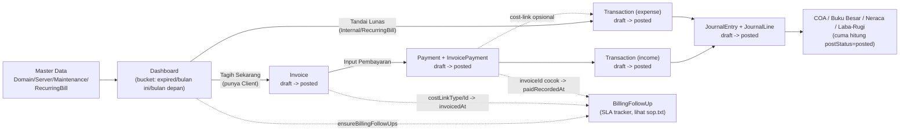

# Konsistensi Data — Tracking dari Awal sampai Akhir

Dokumen ini adalah **peta silang** dari semua `Check-Flow-*.MD` + `pedoman_akunting.md` — bukan
menggantikan, tapi menjawab satu pertanyaan spesifik: **"gimana caranya mastiin data yang masuk
dari awal (Master Data/Dashboard) sampai akhir (Laporan/COA) itu valid & konsisten?"**

Kalau nemu data yang kelihatan aneh (saldo tidak cocok, badge Dashboard beda dari Laporan, dst),
mulai dari sini — cari tahap mana yang "putus", baru masuk ke Check-Flow entitas yang relevan buat
detailnya.

## 1. Peta alur end-to-end (semua entitas)

**Prinsip cash-basis** (`aturan.txt`): Invoice **tidak pernah** bikin jurnal. Satu-satunya titik
pengakuan Pendapatan+PPN+HPP adalah **Payment**. Detail rumus & akun: `pedoman_akunting.md §3`.

## 2. Invariant per tahap — yang HARUS selalu benar

| Tahap | Invariant | Kalau salah, gejalanya |
|---|---|---|
| Master Data → Dashboard | `bucket` Dashboard selalu dihitung ulang dari `expiryDate`/`lastPaidAt`+periode saat request, TIDAK di-cache/simpan | Badge Dashboard "telat" tapi item sebenarnya sudah dibayar (atau sebaliknya) — cek `resolveDomainExpiry`/`resolveServerExpiry`/`computeNextDueDate` dipanggil dengan data terbaru |
| Invoice draft | `subtotal`, `discountAmount`, `ppnAmount`, `totalAmount` konsisten dengan sum `InvoiceLine.lineTotal` | Total invoice tidak cocok sama detail baris — cek ulang `POST /api/invoices` |
| Invoice draft → posted | Draft **tidak kehitung** di piutang/laporan mana pun; posted **wajib** sebelum bisa dibayar (`PembayaranForm` fetch `?postStatus=posted`) | Invoice "hilang" dari daftar Pembayaran → cek `postStatus` |
| Payment draft → posted | Semua `Transaction` dengan `paymentId` yang sama (baris income + cost-link expense) diposting **bareng, atomik** — tidak ada yang setengah-posted | Saldo Kas/Bank tidak seimbang dengan Beban yang tercatat |
| Payment posted | `Invoice.status` (unpaid/partial/paid) = hasil hitung ulang dari total `InvoicePayment` efektif — bukan field yang diisi manual | Status invoice tidak berubah walau sudah lunas → cek `POST /api/payments/[id]/post` |
| Transaction → JournalEntry | Tiap `Transaction` yang bikin jurnal (`journalEntryId` terisi) — debit **HARUS** = kredit di `JournalLine` | Buku Besar/Neraca tidak balance → cek fungsi di `journal-rules.ts` yang dipakai |
| JournalEntry draft → posted | Laporan (`COA`, `Buku Besar`, `Neraca`, `Laba-Rugi Akrual`) **cuma** menghitung `postStatus=posted` | Angka laporan lebih kecil dari yang diharapkan → cek ada draft yang belum diposting |
| Cost-link (Domain/Server/Maintenance) | `lastPaidAt`/`expiryDate` item **cuma** ke-update kalau Payment-nya punya cost-link ke item itu DAN sudah diposting | Item tetap "telat" di Dashboard walau invoice-nya sudah lunas → **gap paling sering kejadian**, lihat §3 |
| BillingFollowUp (SLA) | Satu `(refType, refId)` cuma boleh punya **1 record aktif** (`paidRecordedAt = null`) di satu waktu | Badge SLA dobel/salah tahap → cek `ensureBillingFollowUps` idempotency |

## 3. Titik paling rawan putus: Cost-link

Ini penyebab #1 data "kelihatan tidak sinkron" di seluruh sistem — didokumentasikan berulang di
tiap Check-Flow karena memang paling sering salah:

- **Domain & Server**: auto ke-link kalau invoice dibuat lewat "Tagih Sekarang" (`costLinkType`/
  `costLinkId` tersimpan di Invoice). Invoice yang dibuat manual **tidak** auto-link — staf wajib
  pilih manual di form Pembayaran, kalau lupa maka `lastPaidAt`/`expiryDate` tidak maju walau
  sudah dibayar.
- **Maintenance**: **gap yang diketahui** — form Pembayaran belum ada opsi "Bayar Maintenance",
  jadi auto-link tidak pernah jalan sama sekali untuk Maintenance, harus selalu manual (lihat
  `Check-Flow-Maintenance.MD` poin 2).
- **RecurringBill**: tidak lewat Invoice/Payment sama sekali (langsung "Tandai Lunas"/Kas Keluar),
  jadi tidak relevan dengan gap ini.

**Cara cek manual**: buka invoice yang sudah lunas → kalau item Domain/Server/Maintenance
terkait masih muncul "Lewat Tempo" di Dashboard, cost-link-nya kemungkinan tidak terisi/tidak
dipilih saat Pelunasan.

## 4. Gap yang sudah diketahui (jangan dianggap bug baru)

Konsolidasi dari `pedoman_akunting.md §5` + tiap `Check-Flow-*.MD`:

1. **AI Assistant "catat pemasukan/pengeluaran"** bikin `Transaction` tapi **tidak pernah** bikin
   `JournalEntry` — muncul di Laba Rugi cash-basis, tapi TIDAK di Laba Rugi Akrual/Buku Besar/COA.
2. **Form Pembayaran belum bisa "Bayar Maintenance"** (lihat §3).
3. **Akun COA 1-2000 (Piutang), 2-1000 (Hutang Vendor), 2-3000 (Hutang Biaya Berkala)** orphan —
   tidak dirujuk jurnal baru manapun, dibiarkan untuk kompatibilitas riwayat lama.
4. **Dua sistem bucket paralel untuk RecurringBill** (`ExpiryBucket` di Dashboard vs `DueBucket` di
   cron WA/Master Data) — ambang batasnya beda, bisa saja tidak sepakat "sudah waktunya".
5. **Balas WA "sudah [nama]" cuma update tanggal**, TIDAK bikin catatan pengeluaran — kalau staf
   cuma balas chat tanpa input Kas Keluar, uangnya tidak pernah masuk laporan.
6. **`BillingFollowUp` (SLA tracker) cuma jalan buat item yang punya Client** — Domain/Server
   Internal dan RecurringBill sengaja tidak dilacak SLA-nya (lihat `sop.txt`), jadi tidak akan
   pernah muncul di Laporan Tindak Lanjut Tagihan.

## 5. Checklist verifikasi cepat (manual, per kasus)

Belum ada tool audit otomatis — kalau curiga ada data tidak konsisten, urutan cek manual yang
paling efektif:

1. **Saldo/laporan kelihatan salah** → cek ada `JournalEntry`/`Transaction`/`Payment`/`Invoice`
   yang masih `postStatus: "draft"` (draft tidak kehitung di laporan mana pun).
2. **Item Dashboard "telat" padahal sudah dibayar** → cek cost-link (§3): buka invoice terkait,
   lihat apakah baris Pembayaran-nya punya `costLink`/`costMode` terisi ke item itu.
3. **Jurnal tidak balance** (debit ≠ kredit) → cek fungsi `*Lines()` di
   `src/lib/accounting/journal-rules.ts` yang dipakai buat transaksi itu, bandingkan sama tabel
   §2 `pedoman_akunting.md`.
4. **Badge SLA aneh** (dobel, tidak muncul, atau stage salah) → cek jumlah record
   `BillingFollowUp` aktif (`paidRecordedAt: null`) untuk `(refType, refId)` itu, harus tepat 1
   atau 0.
5. **Angka Laba Rugi vs Laba Rugi Akrual beda jauh** → wajar kalau ada Transaction dari AI
   Assistant (gap #1) atau banyak invoice posted yang belum dibayar (memang belum diakui akrual,
   sesuai `aturan.txt`) — bukan otomatis berarti bug.

## 6. Dokumen terkait

- `aturan.txt` — sumber kebenaran aturan bisnis (cash-basis, dsb).
- `pedoman_akunting.md` — rujukan jurnal & COA secara detail (rumus, tabel akun, gap).
- `sop.txt` — SLA tindak-lanjut tagihan (BillingFollowUp).
- `Check-Flow.MD` (Domain), `Check-Flow-Server.MD`, `Check-Flow-Maintenance.MD`,
  `Check-Flow-BiayaBerkala.MD`, `Check-Flow-Invoice.MD` — jejak teknis lengkap tiap modul.
